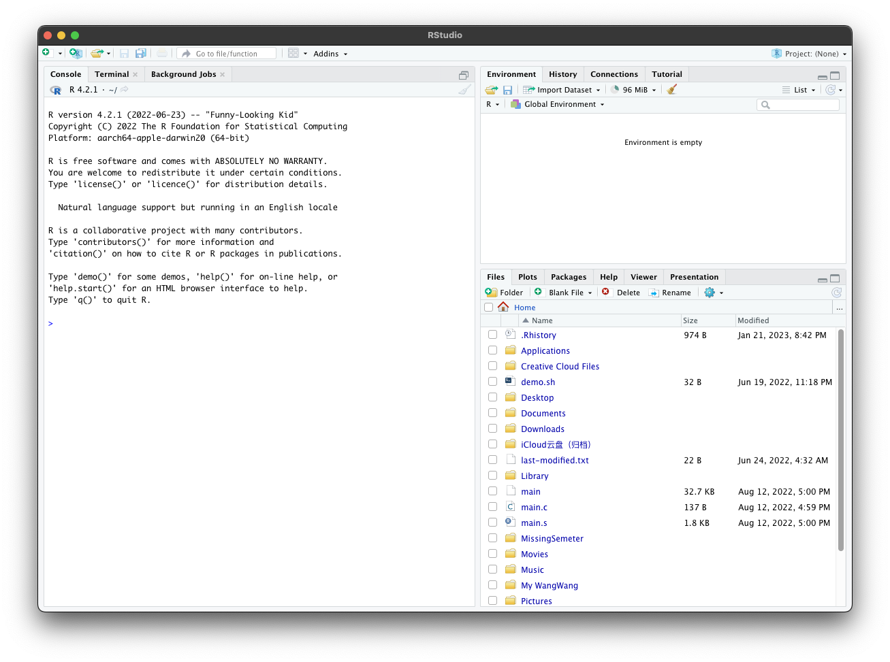
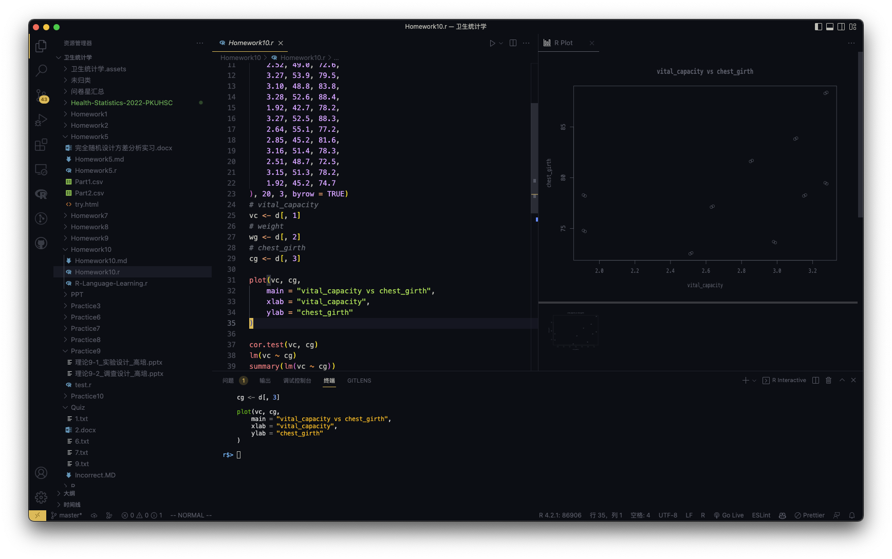
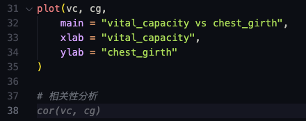

# R语言

## 写在前面

本部分文字部分以 CC BY-NC-SA 4.0 协议公开，代码部分以 GPL3 协议开源，请勿用于盈利用途。

本部分旨在帮助同学们理解R语言的编程概念、熟悉一些语法糖，我会按照作业顺序尽力回忆每次作业所涉及的R语言知识点，但并不包含统计学知识的回顾，有关统计学知识的部分，请参阅 [统计学知识.md](./统计学知识.md)。

部分内容来自于网络以及首都经济贸易大学佟强老师的课件，在此向他们表示感谢。

R文档查询：

* [官方文档](https://stat.ethz.ch/R-manual/R-patched/library/base/html/00Index.html)，这个网站有点简陋，但是是最新的。包含全部内置包参数/函数说明。
* [RDocumentation](https://www.rdocumentation.org/)，这个网站的内置搜索目前存在问题（[issues#128](https://github.com/datacamp/rdocumentation-2.0/issues/128)），建议通过谷歌关键词 `R {query} documentation` 从外部搜索。


## 相关软件配置

### R in VS Code

谷歌/百度关键词：R in VS Code，Radian。

配置成功后，你不仅可以享受更优雅的界面，更可以享受交互式的图表（httpgd）以及更舒适的高亮（R/R debugger）、语法提示，还能获得人工智能提示（Copilot），以及优雅的终端交互（radian）。

#### 配置前后对比

Before：



After：



以及最爽的 AI 提示：



#### 配置方法

参见官方指引：[R in Visual Studio Code](https://code.visualstudio.com/docs/languages/r) 

相关扩展列举：

* AI提示：[Github Copilot](https://github.com/features/copilot) （VS Code扩展，需要Github账号登录）
* 图表：httpgd
* R语言终端：radian（Python R语言服务器，可以通过pip安装），可能需要自行配置键盘快捷键
* R语言参考：R（VS Code扩展）
* 运行脚本：Code Runner（VS Code扩展）
* 颜色主题：Ayu（VS Code主题扩展）
* 自动格式化代码：Prettier（VS Code扩展）

### 配置Markdown

[Typora](https://typora.io/)：基于Electron的现代化Markdown编辑软件，支持丰富的自定义样式、实时预览。

[Typora LaTeX MiSans](./latex-misans.css)主题：请将 latex-misans.css 文件移动至Typora主题文件夹下，需要自行安装MiSans字体。本样式魔改自 [Keldos-Li/typora-latex-theme](https://github.com/Keldos-Li/typora-latex-theme)

### 配置LaTeX OCR识别

参见[Mathpix](https://mathpix.com/)，使用edu邮箱注册可获得100次/月的免费额度。


## R语言基础操作

我会在这里列举一些我认为相对有用的R语言知识、语法，虽然并不全面，但应该能对你有所帮助。

### R是什么？

R是一门偏统计学方向的语言，提供了丰富的统计学方法以及统计资料，是与业数据分析领域的标准。

个人感觉其语言风格介于C与Python之间，同时我认为它并非类似于C/Python这种脚本语言，一个脚本文件完成一件事情，你在学习过程中经常会像debugger一样去一行一行的调试代码，然后分析每步的输出结果，汇总到你的作业里。

类似于C++的 `.cpp` 文件，R语言的脚本文件以 `.r` 为后缀。

### R的包管理工具

如果你在计算概论学过C++，你可能会知道如果在cpp文件前加入 `#include <algorithm>` 后即可使用名为 `sort()`的函数来进行快速排序。这种引用别人写好的代码来简化自己脚本的操作在现代编程中十分常见，一个个被引用的库/包会公开开源在网络上，然后有专门的网站去分发它们，这就是程序包安装网络。

R的程序包安装网络叫CRAN。可以理解为R的pip/npm。

> CRAN：The Comprehensive R Archive Network，简称CRAN，由世界几十个镜像网站组成网络，提供下载安装程序和相应软件包。各镜像更新频率一般为1-2天。
>
> https://cran.r-project.org/

安装包的命令为 `install.packages('package_name')` ，安装后你会需要从镜像中选择一个，一般选择北外或者北大的都可以。一般情况下，你不太会用到安装包，内置的包足够了。如上述配置 R in VS Code时会需要安装一个 `R language server` 的包，此时注意需要全局安装。后期课上助教可能会在做某些作业时告诉你要安装新的包，请不要觉得难（虽然你可能其实并不太需要，因为装了也就是临时用一下，考试也不会用...）

### 调试/运行

以下所有操作以macOS下的VS Code为例（左下角有键位录制）。

`cmd+enter`：逐行执行（最常见）


`选中，然后cmd+enter`：多行一起执行


`cmd+r`：直接运行整个脚本（需要安装Code Runner，告诉VS Code如何编译R脚本，或者自行配置keyboard shortcuts）


## R语言基本语法

### 对象产生、查询、删除

R语言中可操作的各种数据及各种表达式等都叫R语言的对象，对象命名规则如下：

* 对象的名字必须是以一个字母开头（A-Z 或a-z），中间可以包含字母，数字（0-9），点（.）及下划线（_）
* R对象的名字区分大小写
* 避免用R的各种包中的既有对象名来对对象命名：例如，c、 if、 for、 pi等
* 可以通过输入一个对象的名字来显示其内容。

赋值：`x<-...`

删除：`rm(x)`

### 向量（Vector）

由**相同基本类型**的元素构成的一维序列，是最常见的对象，**向量的下标从1开始**（而不是C++/Python等语言的0）。

```R
x<-11:20 # x:11 12 13 14 15 16 17 18 19 20
y<-c(3,5,8) # y:3 5 8
```

### 数据类型

1. 数值型（1,2,3）
2. 字符型（A,B,C）
3. 逻辑型（TRUE/FALSE）

### 对象基本属性

1. `length()`：查看向量长度
2. `dim()`：查看对象维度

### 因子（Factor）

分类变量的整数表示，例如性别、省份、专业。

你可以理解为将一些不连续但是同类别的指标映射到正整数集上的“字典”

其中，原来的不连续分类变量被称为“水平”，映射后的正整数被称为“因子”。

因子是R语言编程中很重要的一个概念，因为后续统计学中经常遇到分类变量。

```R
# factor
factor(x, levels, labels, ordered) # 创建因子，即分类变量，每个类别称为一个水平
# x：向量, unique(x)的元素个数应较少，对应各个分类
# levels：可选，因子的水平，可设置x中元素之外的值，可用于指定有序因子中水平的顺序。
# labels：可选，各个水平的标签，需要和levels等长且顺序保持一致，结果是实现了水平重命名。
# ordered：是否产生有序因子，默认为FALSE
# 例如，创建一个有序因子
x <- factor(
    c("yes", "yes", "no", "yes", "no"),
    ordered = TRUE, levels = c("no", "yes")
)
# [1] yes yes no  yes no 
# Levels: no < yes
```

除此之外，你也可以参见 [R因子-菜鸟教程](https://www.runoob.com/r/r-factor.html) 或者R文档说明。


### 特殊变量

`Inf`，指无穷。1/0=Inf。

`NaN`，其意义为不确定。0/0=NaN。

`NA`，无法得到、缺失或者未定义。在读取不完整的csv文件时可能需要判断移除。

`NULL`，其意义为空的对象。

### 运算

加(+)，减(-)，乘(\*)，除(/），乘方(^)

运算优先级：最高为乘方，然后乘除，最后加减。

其他运算符：整除（%/%）余数（%%）矩阵乘法（%*%）

在R中，运算符实际上是函数。R的运算符是支持向量运算的，如：c(2,5,8)+c(3,6,9)=c(5,11,17)

### 逻辑运算

结果：TRUE/FALSE

逻辑运算符有：

* 大于>
* 小于<
* 大于等于>=
* 小于等于<=
* 等于==
* 不等于!=

### 按元素与或非

`&`：按元素与得到一个向量。

`|`：按元素或逻辑向量。

`!`：每个元素**取反**，常用。

### 逻辑函数

`all()`：判别是否所有元素都为真。

`any()`：判别是否至少有一个元素为真。

`which()`：获取逻辑向量中哪些下标是真。

### 移除缺失数据

`is.na()`

```R
x <- c(2, 5, NA, 8, NA, 11)
x # 2  5 NA  8 NA 11
x <- x[!is.na(x)]
x # 2 5 8 11
```

### 生成规律数据

```R
# 生成序列函数(seq,sequence)
1:n # 生成1到n的整数序列，步长为1
3:-3 # 生成3到-3的整数序列，步长为-1
seq(from = 1, to = 10, by = 2) # 生成1到10的整数序列，步长为2，可简写为下面的形式
seq(1, 10, by = 2) # 生成1到10的整数序列，步长为2

# 注意顺序优先级
1:10 + 2 # 3  4  5  6  7  8  9 10 11 12
1:(10 + 1) # 1  2  3  4  5  6  7  8  9 10 11

# 重复函数(rep,repeat)
rep(1:3, 2) # 1 2 3 1 2 3
rep(1:3, each = 2, times = 2) # 1 1 2 2 3 3
# 第一个参数x代表重复的对象，times代表向量x重复的次数，each代表x中每个元素每次重复的次数

# 生成均匀分布的随机数(ranif,random uniform)
runif(n = 10, min = 0, max = 1) # 生成10个均匀分布的随机数，可简写为下面的形式
runif(10, 0, 1) # 生成10个均匀分布的随机数
# n代表生成的随机数个数，min代表最小值，max代表最大值

# 生成正态分布的随机数(rnorm,random normal)
rnorm(n = 10, mean = 0, sd = 1) # 生成10个均值为0，标准差为1的正态分布随机数，可简写为下面的形式
rnorm(10, 0, 1) # 生成10个均值为0，标准差为1的正态分布随机数
# n代表生成的随机数个数，mean代表均值，sd(standard deviation)代表标准差

# 抽样函数(sample)
sample(1:10, size = 5, replace = TRUE, prob = c(rep(0.1, each = 10)))
# 从1到10中随机抽取5个数，可重复抽取，可简写为下面的形式
sample(1:10, 5) # 从1到10中随机抽取5个数
# size代表抽取的数的个数，replace代表是否可重复抽取
```

## 向量索引与常用函数

### 向量名称与索引

```R
# 向量名字(names)
x <- 1:5
names(x) <- c("a", "b", "c", "d", "e")
x["a"] # 1

# 向量索引([],index)
x <- 1:5
# 整数下标
x[1:3] # 1 2 3
# 逻辑下标，逻辑下标的长度必须和向量的长度相同，且逻辑下标表达式中的x即为遍历时向量元素的值
x[which(x > 3)] # 4 5
# 字符串下标
names(x) <- c("a", "b", "c", "d", "e")
x[c("a", "b")] # 1 2
```

### 子集函数subset()

```R
# 子集(subset)
x <- 1:5
subset(x, x > 3) # 4 5
# 子集函数可以用于从数据框（data frame，你可以暂时理解为excel）中提取数据，如下面的例子
x <- data.frame(a = 1:5, b = 6:10)
#   a  b
# 1 1  6
# 2 2  7
# 3 3  8
# 4 4  9
# 5 5 10
subset(x, a > 3)
#   a  b
# 4 4  9
# 5 5 10


# 获取x中a列的数据
x <- data.frame(a = 1:5, b = 6:10)
x$a # 1 2 3 4 5
x[["a"]] # 1 2 3 4 5
```

### 数学函数（加粗的为常用）

`abs()`：**绝对值absolute value**

`sqrt()`：平方根square root

`log()`：自然对数(base=e)，也可以给出底（base=3）

`log2()`：以2为底的对数

`log10()`：以10为底的对数

`exp()`：以自然对数e为底的指数函数

`sin()`和 `asin()`：正弦和反正弦

`cos()`和 `acos()`：余弦和反余弦

`tan()`和 `atan()`：正切和反正切

`round()`：四舍五入 ，参数digits可以指定小数位数

> 注意：`round(0.5)=0`
>
> 这和数字在内存中以二进制浮点数表示有关，0.5并不能完美地从十进制转为二进制浮点数，所以取整操作和十进制下有出入。类似地有：0.1+0.2!=0.3（此类型问题广泛出现在各种编程语言中，如C++/Python/JavaScript，但C#中提供了decimal十进制浮点数类型来规避）
>
> 官方说明可参见：[Floating Point Arithmetic: Issues and Limitations](https://docs.python.org/release/3.6.8/tutorial/floatingpoint.html#tut-fp-issues)

`floor()`：向下取整

`ceiling()`：向上取整

`trunc()`：去掉小数部分得到整数

`factorial(x)`：阶乘

`choose(n，k)`：从n个中选出k个，取到的k个元素不考虑顺序，即组合数

`combn(x，k)`：列出从x中选取k个的全部组合排列数，从n个中选出k个，并排序

> `combn(x，k)=choose(n，k)*factorial(k)`

`sum()`：**向量中全部元素的累加和**

`prod()`：向量中全部元素的乘积

### 统计函数（常用）

`max()`：最大值

`min()`：最小值

`range(x)`：与`c(min(x)，max(x))`作用相同

`which.max()`：最大数的下标

`which.min()`：最小数的下标

`mean()`：均值

`median()`：中位数

`sd()`：标准差 Standard Deviation

`var()`：方差 Variance

`summary()`：对象的概括

**上述函数均十分常用，建议搭配随机生成数据函数自行尝试使用几次，因为它们在验证分布/汇报数据分布/分析统计结果时，经常使用到。**

### 排序/去重/清洗数据

`sort(x)`：升序或降序排序

`order(x)`：返回使得x升序或降序排序的下标向量

> `x[order(x)]`等效于`sort(x)` 
>
> 如需降序，请在函数`sort`和`order`中，传递参数`decreasing=TRUE`

`rev(x)`：向量x的元素取逆序得到一个新的向量（reverse）

`unique(x)`：去重

`na.rm = TRUE`：在读取csv文件（`read.csv()`）或者生成数据框 `dataframe` 时可能会用到，效果为移除NA值（remove NA）。

## 其他数据结构

### 矩阵

```R
# 矩阵
# 矩阵的创建
x <- matrix(
    1:6,
    nrow = 2, ncol = 3, byrow = TRUE, 
    dimnames = list(c("a", "b"), c("c", "d", "e"))
)
#   c d e
# a 1 2 3
# b 4 5 6
# 1:6代表矩阵的元素，nrow代表矩阵的行数，ncol代表矩阵的列数，byrow代表是否逐行填充，dimnames代表矩阵的行列名
# byrow参数默认为FALSE，即逐列填充
# 矩阵的行列名可以用下面的方法获取
dimnames(x) # [[1]] c("a", "b") [[2]] c("c", "d", "e")
rownames(x) # [1] "a" "b"
colnames(x) # [1] "c" "d" "e"
# 矩阵的行列数可以用下面的方法获取
dim(x) # 2 3
nrow(x) # 2
ncol(x) # 3
# 矩阵的转置
t(x) # 等价于x'，即行列互换
```

除了这些之外，R中还提供了线性代数中常用的一些操作函数，如取上下三角/求解线性方程组/求逆矩阵/QR分解/求特征值/求秩/奇异值分解等，但在卫生统计学课程中均不会涉及，故在此略去。如想要了解可以自行查阅R说明文档。

### 列表

列表用以存储类型不同的数据，如你想要将一个数和一个向量存在一起，就需要使用列表，但一般不会用到。

`list(object1, object2, ...)`

### 数据框（常用）

数据框是一个二维表，每行称为一个**观测**，每列称为一个**变量**，各列的数据类型可以不同，但各列的长度必须一样(二维表)。

数据框的形式类似于csv数据文件，所以读取csv后默认以此形式存储。故掌握其索引、创建等操作非常重要。

以下就是常见的csv形式，你可以借此理解数据框的储存形式：


#### 创建数据框

```R
# 数据框(data frame)
# 数据框的创建
x <- data.frame(
    a = 1:5, b = 6:10, c = 11:15,
    row.names = c("a", "b", "c", "d", "e")
)
# data.frame(name1=col1, name2=col2, ..., stringsAsFactors=TRUE)
# 默认情况下，数据框中的字符串会被转换成因子， 如果不希望字符串转成因子，可以传递参数 stringsAsFactors=FALSE

# 读取CSV文件创建数据框
# read.csv(“./person.csv“，fileEncoding=“GB18030“)
# read.csv(“./person_utf8.csv“，fileEncoding=“UTF-8“)
# 一般情况下，文件以UTF-8编码保存，此时不需要指定ileEncoding参数。如果文件以GB18030编码保存，需要指定fileEncoding参数
```

#### 数据框的摘要

`summary(frame)`：获取对象的统计摘要。

数值型的列：最小值、最大值、均值、中位数、四分位数（在整个列中排第25%、50%、75%的数）等

因子所在列：统计每个水平的个数

```R
# summary
# summary函数可以用于查看数据框的基本信息
x <- data.frame(
    a = 1:5, b = 6:10, c = c("p", "k", "u", "n", "b"),
    row.names = c("a", "b", "c", "d", "e")
)
summary(x)
#        a           b           c            
#  Min.   :1   Min.   : 6   Length:5          
#  1st Qu.:2   1st Qu.: 7   Class :character  
#  Median :3   Median : 8   Mode  :character  
#  Mean   :3   Mean   : 8                     
#  3rd Qu.:4   3rd Qu.: 9                     
#  Max.   :5   Max.   :10
```

#### 查看数据框基本信息

`head(x)`：查看数据框的前几行

`tail(x)`：查看数据框的后几行

`nrow(x)`：获得数据框的行数

`ncol(x)`或`length(x)`：获得数据框的列数

`dim(x)`：获得数据框的行数和列数

`colnames(x)`或`names (x)`：管理列的名字

`row.names(x)`或`rownames(x)`：管理行的名字

#### 数据框的索引（重要）

```R
# 数据框的索引
x <- data.frame(
    a = 1:5, b = 6:10, c = c("p", "k", "u", "n", "b"),
    row.names = c("a", "b", "c", "d", "e")
)
x$a # 1 2 3 4 5
x[["b"]] # 6  7  8  9 10
x[2:3] # 第2列到第3列构成的子数据框
#    b c
# a  6 p
# b  7 k
# c  8 u
# d  9 n
# e 10 b
```

#### 数据框操作（重要）

我记得助教在将这个时似乎用了dplyr包的函数，但其实并不需要。

```R
# 数据框操作
x <- data.frame(
    a = 1:5, b = 6:10, c = c("p", "k", "u", "n", "b"),
    row.names = c("a", "b", "c", "d", "e")
)

# 增加列
x$d <- 11:15
#   a  b c  d
# a 1  6 p 11
# b 2  7 k 12
# c 3  8 u 13
# d 4  9 n 14
# e 5 10 b 15

# 修改列
x$d <- 21:25
#   a  b c  d
# a 1  6 p 21
# b 2  7 k 22
# c 3  8 u 23
# d 4  9 n 24
# e 5 10 b 25

# 删除列
x$d <- NULL
#   a  b c
# a 1  6 p
# b 2  7 k
# c 3  8 u
# d 4  9 n
# e 5 10 b

# 增加行
rbind(x, data.frame(a = 6, b = 11, c = "c", row.names = "f"))
#   a  b c
# a 1  6 p
# b 2  7 k
# c 3  8 u
# d 4  9 n
# e 5 10 b
# f 6 11 c

# 本质是将两个数据框合并（注意每列的数据类型要对应），合并后的数据框的行数是两个数据框行数之和
```

#### with函数（偷懒不写索引）

```R
# with函数
# with函数可以用于简化对数据框的操作
# with(data, expression)
# 例如，对数据框x，计算a列的均值
with(x, mean(a)) # 3
# 与下面的写法等价
mean(x$a) # 3
# 看起来似乎没有简化多少，但这是因为现在只对单行操作，如果对多行操作，with函数就会显得非常有用了，如绘制图表
with(x, plot(a, b))
```

## R语言编程

一般在卫生统计学课程中用不到太多，除非你想自己实现某个内置包不存在的函数。

R语言的编程思想是基于函数的，函数是R语言的基本构建块，R语言中的函数可以分为两类：内置函数和用户自定义函数

### 顺序语句

顺序语句是R语言中最基本的语句，顺序语句是指按照顺序执行的语句，顺序语句之间用分号分隔。

顺序语句的执行顺序是从上到下，从左到右，执行结果是最后一个语句的执行结果，这也是为什么当你使用`cmd+r`执行一整个脚本时，其中的输出都不会显示，也不会执行中间的绘制图表操作，只会返回最后一句代码的返回结果。

顺序语句的执行结果可以被赋值给变量、传递给函数、传递给其他语句。

当你将一块代码用花括号{}包裹起来时，它们会视为顺序语句一起执行。

### 条件语句

#### if

```R
# if语句
# if (condition) {
#     expression
# } else if (condition) {
#     expression
# } else {
#     expression
# }
# 例如，判断一个数是正数还是负数
x <- 1
if (x > 0) {
    print("positive")
} else {
    print("negative")
}
# [1] "positive"
```

if语句是有值的，可以用于赋值

```R
# 判断成绩
score <- 80
grade <- if (score > 100 || score < 0) {
    "invaild"
} else if (score > 60) {
    "pass"
} else {
    "fail"
}
grade
# [1] "pass"
```

#### repeat

```R
# repeat 语句
# repeat {
#     expression
#     if (condition) {
#         break
#     }
# }
# 例如，计算1到100的和
sum <- 0
i <- 1
repeat {
    sum <- sum + i
    i <- i + 1
    if (i > 100) {
        break
    }
}
sum
# [1] 5050
```

#### while

```R
# while 语句
# while (condition) {
#     expression
# }
# 例如，计算1到100的和
sum <- 0
i <- 1
while (i <= 100) {
    sum <- sum + i
    i <- i + 1
}
sum
# [1] 5050
```

#### for

```R
# for 语句
# for (variable in sequence) {
#     expression
# }
# 例如，计算1到100的和
sum <- 0
for (i in 1:100) {
    sum <- sum + i
}
sum
# [1] 5050
```

seq是要遍历的向量/列表，var是循环变量，每次获得向量中的一个元素或者列表中的一个组件。

#### next/break

```R
# next 与 break
# next 类似于 Python 中的 continue，跳过本次循环，继续下一次循环
# 例如，计算1到100的和，但是跳过10的倍数
sum <- 0
for (i in 1:100) {
    if (i %% 10 == 0) {
        next
    }
    sum <- sum + i
}
sum
# [1] 4500

# break 跳出循环
# 例如，计算一个数是否为素数
is_prime <- function(x) {
    if (x <= 1) {
        return(FALSE)
    }
    for (i in 2:(x - 1)) {
        if (x %% i == 0) {
            return(FALSE)
        }
    }
    return(TRUE)
}

```

注意到上述例子中，我们使用 `function()` 创建了一个函数，这是在R中实现自定义函数的操作，十分常用，接下来我们将讲述它的用法。

### 创建函数

```R
# 创建函数
# 函数的定义
# myFunc <- function (arg1, arg2, ...) {
#     expression
# }
# 例如，计算两个数的和
add <- function(x, y) {
    return(x + y)
}
add(1, 2)
# [1] 3
# 如果不写return, 则默认返回最后一行的值
# myFunc是函数名，arg1, arg2是参数，...表示可变参数，expression是函数体
# 更进一步的参数匹配等偏编程的知识并不在本课程的范围内，可以参考R语言官方文档
```

## 图表绘制

### 散点图plot


```R
# 图表绘制
# plot，绘制散点图
# plot(x, y, type, main, sub, xlab, ylab, xlim, ylim, col, pch, lty, lwd)
# x：x轴数据
# y：y轴数据
# type：图表类型，p表示散点图，l表示折线图，b表示条形图
# main：图表标题
# xlab：x轴标题; ylab：y轴标题
# xlim：x轴范围; ylim：y轴范围
# col：颜色; pch：点的形状; lty：线的类型; lwd：线的宽度
# 例如，绘制一个散点图
x <- c(1, 2, 3, 4, 5)
y <- c(1, 4, 9, 16, 25)
plot(
    x, y,
    type = "l",
    main = "散点图", xlab = "x", ylab = "y",
    col = "#8C0000"
)
# lim是一个向量，表示x轴和y轴的范围，例如，xlim = c(0, 10)表示x轴范围为0到10
# type参数指定绘制类型，详细说明可以参见R语言官方文档
```

在散点图中指定type参数可以绘制折线图。

参考：[plot{base}](https://stat.ethz.ch/R-manual/R-patched/library/base/html/plot.html)

### 条形图barplot


```R
# barplot，绘制条形图
# barplot(x, main, xlab, ylab, xlim, ylim, col, horiz=FALSE, beside=FASLE)
# x：数据
# main：图表标题
# xlab：x轴标题; ylab：y轴标题
# xlim：x轴范围; ylim：y轴范围
# col：颜色
# horiz：是否水平绘制，默认为FALSE
# beside：是否并排绘制，默认为FALSE
# 例如，绘制一个条形图
y <- c(1, 4, 9, 16, 25)
# 水平条形图
barplot(
    y,
    main = "条形图", xlab = "x", ylab = "y",
    col = "#8C0000",
    horiz = TRUE
)
```

barplot的数据只传入第一个height参数，其类型如下：

* 向量，此时每个元素绘制一个柱形。
* 矩阵，且`beside=FALSE`，此时每列数据绘制一个堆积的矩形。
* 矩阵，且`beside=TRUE`，此时每列数据绘制多个并列的矩形。

`beside=TRUE`：


```R
# 输入矩阵时，beside参数
x <- matrix(c(1, 2, 3, 4, 5, 6), nrow = 2)
barplot(
    x,
    main = "条形图", xlab = "x", ylab = "y",
    col = c("#6800AA", "#8C0000"),
    beside = TRUE
)
```

`beside=FALSE`:


```R
# 输入矩阵时，beside参数
x <- matrix(c(1, 2, 3, 4, 5, 6), nrow = 2)
barplot(
    x,
    main = "条形图", xlab = "x", ylab = "y",
    col = c("#6800AA", "#8C0000"),
    beside = FALSE
)
```

如果想要指定更详细的参数，请参阅官方文档。

参考：[barplot{base}](http://stat.ethz.ch/R-manual/R-patched/library/graphics/html/barplot.html)

### 直方图hist


绘制过程：将大量的数据以间断点形式分割，统计每个区间内的数量，然后绘制条形图。

```R
# hist，绘制直方图
# hist(x, breaks, main, xlab, ylab, xlim, ylim, col)
# x：数据
# breaks：分段点
# main：图表标题
# xlab：x轴标题; ylab：y轴标题
# xlim：x轴范围; ylim：y轴范围
# col：颜色
# 例如，绘制一个正态分布直方图
x <- rnorm(1000)
hist(
    x,
    breaks = 20,
    main = "直方图", xlab = "x", ylab = "y",
    col = "#8C0000"
)
```

breaks参数一般以一下两种形式给出：

* 1个整数，代表分段数量，此时会以数值型变量x升序等距分类成breaks参数组。
* 数值型向量，给出各个分段点的值，包括左右端点。

### 箱线图boxplot

箱线图用于反映原始数据分布的特征。

它可反映出一组数据中的最大值、最小值、中位数、上下四分位数，还可以通过绘制每组数据集的箱线图来比较多组数据之间的数据分布。


```R
# boxplot，绘制箱线图
# boxplot(x, main, xlab, ylab, xlim, ylim, col)
# x：数据
# main：图表标题
# xlab：x轴标题; ylab：y轴标题
# xlim：x轴范围; ylim：y轴范围
# col：颜色
# 例如，绘制一个箱线图
x <- rnorm(1000)
boxplot(
    x,
    main = "箱线图", xlab = "x", ylab = "y",
    col = "#8C0000"
)
```

### 线lines / 点points

在散点图、柱状图中可以使用`lines()`函数来在已有图像中绘制新的线。


```R
# lines and points
# lines(x, y, type, lty, lwd, col)
# points(x, y, type, pch, cex, col)
# x：x轴数据
# y：y轴数据
# type：绘制类型，详细说明可以参见R语言官方文档
# lty：线条类型，详细说明可以参见R语言官方文档
# lwd：线条宽度
# col：颜色
# pch：点的形状，详细说明可以参见R语言官方文档
# cex：点的大小
# 例如，在绘制的正弦函数图上绘制余弦函数线
x <- seq(0, 2 * pi, length = 100)
y <- sin(x)
plot(
    x, y,
    main = "三角函数", xlab = "x", ylab = "y",
    type = "l", lty = 2, lwd = 2, col = "#8C0000"
)
lines(
    x, cos(x),
    type = "l", lty = 2, lwd = 2, col = "#6800AA"
)
# 在绘制的正弦函数图上绘制正切函数点
points(
    x, tan(x),
    type = "p", pch = 1, cex = 1, col = "#FACC15"
)
```

## 读写文件

常用函数实际上只有 `read.csv()` 一个：

```R
# read.csv
# read.csv(file, encoding = "UTF-8")
# file：文件路径
# encoding：编码，默认为UTF-8
# 例如，读取一个csv文件
data <- read.csv("sample.csv", encoding = "UTF-8")
names(data)
# [1] "block" "group" "score"
head(data) # 查看前6行数据
#   block group score
# 1     1     A   8.4
# 2     1     B   9.6
# 3     1     C   9.8
# 4     1     D  11.7
# 5     2     A  11.6
# 6     2     B  12.7
tail(data) # 查看后6行数据
data$score # 查看score列数据
# [1]  8.4  9.6  9.8 11.7 11.6 12.7 11.8 12.0
# 读取后的csv文件是一个数据框。
```

## 统计学函数

此处为实际上机授课重点，建议根据老师课件搭配谷歌/百度/CSDN自学，因为实际上听老师/助教授课的体验较为糟糕。我将在下面列举出一些常用的知识点，具体怎么看、怎么分析数据请搭配`统计学知识.md`和作业、课件、教材一起学习。

### d、p、q、r函数前缀

这四个函数前缀你将在很多地方见到，因为它们太常用了，在此我以二项分布函数为例简单介绍一下它们都是什么。

```R
dbinom(x, size, prob, log = FALSE)
pbinom(q, size, prob, lower.tail = TRUE, log.p = FALSE)
qbinom(p, size, prob, lower.tail = TRUE, log.p = FALSE)
rbinom(n, size, prob)
```

请记住以下概念：**d、p、q、r分别表示概率密度函数、概率累积分布函数、分位数函数、随机数生成函数**


#### d前缀：概率密度函数，probability density function

此前缀主要用以获得分布在某一特定点的概率或者概率密度，如下例：


```R
plot(0:10, dbinom(0:10, 10, 0.5), type = "h", col = "#8C0000", main="概率密度函数")
```


#### p前缀：概率累积分布函数，probability cumulative distribution function

实际上是d函数的积分。某一点的值是“所有分布小于此点的值的概率总和”


```R
plot(0:10, pbinom(0:10, 10, 0.5), type = "h", col = "#8C0000", main="概率累积分布函数")
```


#### q前缀：分位数函数，quantile function

是p函数的反函数，通过累积概率值反求分位点。


```R
plot(seq(0, 1, length = 100), qbinom(seq(0, 1, length = 100), 10, 0.5), type = "h", col = "#8C0000", main = "分位数函数")
```

#### r前缀：随机数函数，random function

用于生成一组符合指定分布的数。


```R
x <- rbinom(100, 10, 0.5) # 二项分布随机数生成函数
plot(1:100, sort(x),col="#8C0000", main = "随机数生成函数")
```

可以看到，当数据总量n足够大时，将随机数函数排序后，分布十分接近于分位数函数。这也是随机生成的数符合指定分布的证据之一。

