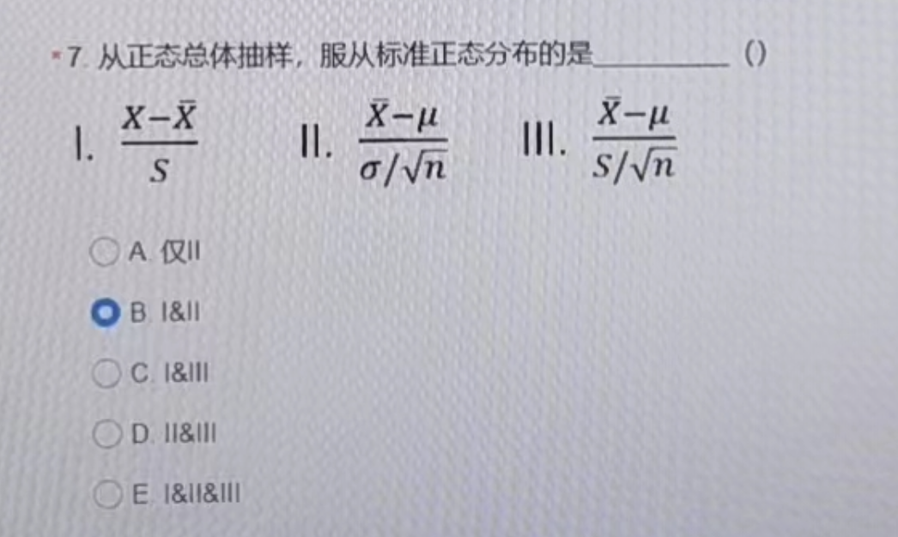

# 绪论

## 基本概念

-   总体：按照统计
-   抽样：从总体中抽取的动作
-   样本：抽取的部分个体
-   数据：观察所得资料
-   推断：分析样本数据，并且给出结论、知识、规律
-   系统误差：因为试剂未校正或者仪器没有调零等因素造成的研究结果倾向性的增大或减小。特点为倾向性的增大或减小，**可以避免**，如果我们进行调零，系统误差就可以避免。
-   随机误差：由各种偶然因素造成的观察值与真值之差。**不可以避免**，但可以减少。
-   过失误差：过失误差是由于观察过程中的不仔细造成的错误判断或记录。过失误差可以通过仔细核对避免。
-   抽样误差：因为抽样造成的样本统计量与总体参数之间的差异。因为存在个体变异，样本统计量与总体参数存在误差。**不可以避免，但可以减少，我们可以通过增大样本量进行减少**。
-   同质性：共性
-   变异：个体间差异

统计学的任务：在变异的背景上，描述同一总体的同质性（规律）， 揭示不同总体的异质性 (heterogeneity)。

## 变量类型

-   定性变量 (qualitative variable)：学历、婚姻状况、就业、血型

-   定量变量 (quantitative variable) ：年龄、 家庭人口数

**定性变量：分类变量 (categorical variable)**

-   二分类变量：性别
-   无序多分类变量：血型
-   有序多分类变量，等级变量：学历

**定量变量**

-   离散型定量变量（discrete variable）: 家庭人口数
-   连续型定量变量（continuous variable）: 年龄

**参数与统计量**

-   参数（parameter）: 描述总体特征的指标，希腊字母，总体均数 $\mu$
-   统计量（statistic）: 样本的指标，英文字母，样本均数 $\bar{x}$

**事件**

-   事件
-   随机事件
-   概率：度量事件发生的机会大小
-   优势：事件发生的概率与不发生的概率之比

## 频数分布表、图

-   不同组别的观察值个数就称为频数 (frequency)，表示观察值在各组出现的频繁程度

-   将分组和相应的频数列表，即为频数分布表，简称频数表（frequency table）

-   左偏分布（负偏态）中：mean（平均数）<median（中位数）<mode（众数）。

-   右偏分布（正偏态）中：mode（众数）<median（中位数）<mean（平均数）。

    > 偏度本身是相对于均值左右数据的多少。右偏（尾巴一定是在右边），也就是说数据在均值左侧的数量较多，所以为了达到所有数据于均值之差和为 0，应该存在较大的数与之平衡，所有分布图里有一个很长的右端的拖尾（就是右端必须存在很大的值）。

**集中趋势描述**

1. 均数
2. 几何均数（对数均数的幂）
3. 众数
4. 中位数
5. 百分位数

**离散程度的描述**

1. 极差 R
2. 四分位数间距 $Q=Q_{upper}-Q_{lower} (e.g.\ P75-P25)$
3. 方差 $\sigma^2$ 总体方差、$s^2$ 样本方差
4. 标准差 $\sigma$
5. 变异系数 $CV=\frac{s}{\bar{x}}\times 100\%$ 样本标准差 / 样本均数

极差、四分位常用于非正态

标准差、方差常用于对称分布资料、正态分布资料

# 正态分布

$$
x \sim N\left(\mu, \sigma^2\right)
$$

$\mu$ 均数 $\sigma$ 标准差

**标准化变换**

$$
Z=\frac{x-\mu}{\sigma}\\
Z\sim N(0,1)
$$

-   1.64:90%
-   1.96:95%
-   2.58:99%

偏度 (Skewness)（正态），＜ 0（负偏，左偏），＞ 0（正偏，右偏）

峰度 (Kurtosis):0 （正态），<0（平缓），>0（陡峭）


P-P plot

统计分析

-   考虑抽样方式、抽样误差 --> 参数估计

定量变量、定性变量

有序分类变量、无序分类变量、二分类变量

抗体滴度：跳跃度大、取对数的均数再取指数，得几何均数

有偏的情况可以考虑使用中位数来描述平均程度

正态分布最好的标准是标准差或者再加上一个方差

构成比 = 结构相对数

频率：频数 / 样本总数

# 二项分布与泊松分布

## 离散型分布

### 伯努利分布

| X   | 1     | 0       |
| --- | ----- | ------- |
| P   | $\pi$ | $1-\pi$ |

均数 $\mu_X=\pi$

方差 $σ_X^2 = \pi(1-\pi)$

$$
X\sim P(\pi)
$$

### 二项分布

N 重伯努利分布中，成功次数 X 的分布

-   重复试验
-   实验结果独立
-   两种结果
-   成功 / 阳性概率确定

$$
X\sim B(n,\pi)
$$

-   无论 n 大小， π=0.5 时图形呈对称
-   n 不大，π<0.5 时图形呈正偏峰
-   n 不大，π>0.5 时图形呈负偏峰
-   n 大，nπ 和 n (1-π)>5 时，图形接近对称（**二项分布正态近似**）

均数 $\mu_X=n\pi$

方差 $σ_X^2 = n\pi(1-\pi)$

标准差 $σ_X = \sqrt{n\pi(1-\pi)}$

**独立随机变量相加减，均数、方差可以加减**

```R
dbinom(x, size, prob, log = FALSE)
pbinom(q, size, prob, lower.tail = TRUE, log.p = FALSE)
qbinom(p, size, prob, lower.tail = TRUE, log.p = FALSE)
rbinom(n, size, prob)
```

#### 样本估计总体

阳性事件发生频率：$p=x/n$

均数 $\mu_p=\pi$

方差 $\sigma_p^2=\pi(1-\pi) / n$

标准差 $\sigma_p=\sqrt{\pi(1-\pi) / n}$

上述三个统计量可以根据 $p=x/n$ 推得

当 $\pi$ 末知时，用 $\mathrm{s}_{\mathrm{p}}$ 估计 $\sigma_{\mathrm{p}}$, 公式为 $s_p=\sqrt{p(1-p) / n}$ 。

标准误（standard error），样本平均数的标准差。

### 泊松分布

概念：常用于描述有限时间、平面或空间中罕见质点总数的分布规律。也可视为 $n$ 很大，$π$ 很小时二项分布 $B(n,\pi)$ 的极限情形。

条件：

1. 大量重复 n 次，每次为二分类结果（阳性或阴性）
2. 每次结果相互独立
3. 阳性概率 $π$ 很小，不变

> -   當一個事件，在一段時間 ($T$) 中可能發生的次數是 $\lambda$ 。那麼我們可以認爲，經過時間 $T$ 該事件發生的期望次數是 $E(X)=\lambda T$。
> -   利用微分思想，將這段時間 $T$ 等分成 $n$ 個時間段，當 $n\rightarrow\infty$ 直到每個微小的時間段內最多發生一次該事件。
>
> 那麼
>
> -   每個微小的時間段，可以視爲是一個伯努利實驗（有事件發生或者沒有）
> -   那麼這整段時間 $T$ 內發生的事件可以視爲是一個二項分佈實驗。
>
> 令 $X=$ 一次事件發生時所經過的所有時間段。
>
> -   $X \sim Bin(n, \pi)$，其中 $n\rightarrow\infty$，$n$ 爲時間段。
> -   在每個分割好的時間段內，事件發生的概率都是：$\pi=\frac{\lambda T}{n}$
> -   期望 $\mu=\lambda T \Rightarrow \pi=\mu/n$
>
> Reference:https://wangcc.me/LSHTMlearningnote/poisson.html

$$
P(X=k)=\frac{e^{-\lambda} \lambda^k}{k !}, k=0,1,2, \ldots
$$

> 推导
>
> $$
> \begin{aligned}
> & P(X=k)=C_n^k \pi^k(1-\pi)^{n-k}, k=0,1, \ldots n \\
> & \lambda=\mu_X=n \pi, \pi=\frac{\lambda}{n} \\
> & \lim _{n \rightarrow \infty} P(k)=\lim _{n \rightarrow \infty} \frac{n !}{k !(n-k) !}\left(\frac{\lambda}{n}\right)^k\left(1-\frac{\lambda}{n}\right)^{n-k}=\frac{e^{-\lambda} \lambda^k}{k !}\\
> &最后一步用了重要极限
> \end{aligned}
> $$

$$
X\sim \Pi(\lambda)
$$

**正态近似条件**

泊松分布图形受 λ 影响，当 λ 较小时，其图形呈正偏峰随 λ 增大，图形趋于对称当 λ>20 时，可认为近似正态分布。

**总体均数和总体方差**

均数 $\mu_X=\lambda$

方差 $\sigma_X^2=\lambda$

标准差 $\sigma_X=\sqrt{\lambda}$

**性质**

1. 泊松分布属于离散型分布
2. 泊松分布可看成二项分布的特例
3. 泊松分布的总体均数 $\mu_X$< 等于总体方差 $\sigma_X^2$，均为 $\lambda$
4. $\lambda>20$ 时，泊松分布近似正态分布
5. 泊松分布的可加性（小单位合成大单位，独立随机变量之和）

> d：密度函数（density function） , 给出密度函数值
> p：分布函数（cumulative distribution function）, 给出 P (X &lt;= q) 的概率值，此处的 p 即表示概率（probability）
> q：分位数函数（quantile function）, 给出使得 P (X &lt;= q) = p 的 q 值（分位数值）
> r：⽣成随机数函数（random digits function）


# 随机抽样

## 基础

连续性随机变量：存在概率密度函数。具体到某个值的概率为 0

数学期望 $E(X) =\int_{-\infty}^{\infty} x f(x) d x$

方差 ${var}(X) =E(X-E(X))^2=E\left(X^2\right)-E^2(X)$

积分限位正负无穷时积分等于 1

> $$
> \begin{aligned}
> & D(X)=E\left((X-E(X))^2\right) \\
> & =E\left(X^2-2 X E(X)+E(X)^2\right) \\
> & =E\left(X^2\right)-2 E(X) E(X)+E(X)^2 \\
> & =E\left(X^2\right)-E(X)^2
> \end{aligned}
> $$
>
> Reference: https://www.zhihu.com/question/525947244/answer/2423157519

$$
E(X_1\pm X_2) = E(X_1) \pm E(X_2)\\
D(X_1\pm X_2) = D(X_1) + D(X_2)\\
hint:独立变量协方差为0
$$

## 正态分布

$$
\begin{aligned}
& f(x)=\frac{1}{\sqrt{2 \pi} \sigma} \exp \left\{-\frac{(x-\mu)^2}{2 \sigma^2}\right\},-\infty<x<\infty \\
& \mathrm{F}(x)=\frac{1}{\sqrt{2 \pi} \sigma} \int_{-\infty}^x \exp \left\{-\frac{(t-\mu)^2}{2 \sigma^2}\right\} d t,-\infty<x<\infty
\end{aligned}
$$

数学期望 $E(X)=\int_{-\infty}^{\infty} x f(x) d x=\mu$

方差 ${var}(X)=E(X-E(X))^2=E\left(X^2\right)-E^2(X)=\sigma^2$

## 抽样分布

**统计量**

设 $X_1,X_2,…X_n$ 是总体 X 的一个随机样本，$T(X_1,X_2,…X_n)$ 为一个 $n$ 元连续函数，且 $T$ 中不含任何关于总体分布的未知参数，则称 $T(X_1,X_2,…X_n)$ 为一个 **统计量**（statistic），称统计量的分布为抽样分布。

-   样本均值 $\bar{\mathrm{X}}=\frac{1}{n} \sum_{i=1}^n X_i$
-   无偏样本方差 $S^2=\frac{1}{n-1} \sum_{i=1}^n\left(X_i-\bar{X}\right)^2$
-   样本标准差

$n-1$ : 无偏，如果是 $n$，自由度小，因为 $X_n$ 可以由均值和前 $n-1$ 个量推知

带帽子：估计值

## 大数定律

设 $X_1,X_2,…X_n$ 独立同分布（期望、方差相等），则当 $n\rightarrow+\infin$ 时，$\bar{X} \rightarrow \mu$

## 中心极限定理

设 $X_1,X_2,…X_n$ 独立同分布（期望、方差相等），则当 $n\rightarrow+\infin$ 时

$$
\lim _{n \rightarrow \infty} F_n\left(\frac{\bar{X}(n)-\mu}{\left(\frac{\sigma}{\sqrt{n}}\right)}\right)=\Phi(x), \Phi(x) \sim N(0,1)
$$

正态检验：中心极限定理去掉 n 趋于无穷，增加要求：**同分布为正态分布**

**经验分布函数**

阶梯式积分函数。

设 $X_1, X_2, \ldots X_n$ 是总体 $X$ 的一个样本，$X \sim F(X), F_n(X)$ 称为经验分布函数。

$$
F_n(x)=\left\{\begin{array}{lc}
0, & x<X_{(1)} \\
\frac{k}{n}, & X_{(k)} \leq x<X_{(k+1)} \\
1, & x \geq X_{(n)}
\end{array}\right.
$$

其中，$X(k)$ 为顺序统计量，$X_{(1)}=\min (X i), X_{(n)}=\max \left(X_i\right)$

与总体参数无关

```R
ecdf(x)
```

## 卡方分布（$\chi^2$ 分布）

设 $X_1, X_2, \ldots, X_n$ 是总体 $N(0,1)$ 的一个样本，则称统计量

$$
Y=X_1^2+X_2^2+\cdots+X_n^2
$$

服从自由度为 $n$ 的 $X^2$ 分布，记作 $Y \sim \chi^2(n)$

$$
E(Y)=n \quad D(Y)=2 n
$$

```R
# chisq test
{
    d <- c()
    for (i in 1:10000) {
        y <- rnorm(20) # n
        y <- y^2
        d <- c(d, sum(y))
    }
    x <- seq(-3, 3, 0.1)
    hist(d, freq = FALSE, breaks = 100, ylim = c(0, 0.2), xlim = c(0, 35))
}
```

## $t$ 分布

定义：设 $X \sim N(0,1), Y \sim \chi^2(v)$, 且 $X,Y$ 相互独立，则随机变量

$$
T=\frac{X}{\sqrt{Y / v}}
$$

服从自由度为 $v$ 的 $t$ 分布，记为 $T \sim t(v)$

**特征**
$t$ 分布以 $0$ 为中心左右对称

$$
v \rightarrow \infty, t(v) \rightarrow N(0,1)
$$

## 样本均数的抽样分布

抽样误差：抽样产生的误差

均数的抽样误差：样本均数与总体均数的差别，或多次抽样中样本均数之间的差别

均数的抽样误差的大小：常用样本均数的变异性大小来度量，即样本均数的标准差，标准误 $SEM$

$$
\mathrm{SEM}=\sigma_{\overline{\mathrm{X}}}=\sigma / \sqrt{n} \quad \widehat{\mathrm{SEM}}=\mathrm{S}_{\overline{\mathrm{X}}}=\mathrm{S} / \sqrt{n}
$$

$\sigma$ 是总体标准差，$S$ 是样本标准差

### 正态总体

$$
E(\bar{X})=\mu, \quad \sigma_{\bar{X}}^2\ or\ D(\bar{X})=\sigma^2 / n\\

\sigma_{\bar{X}}=s d(\bar{X})=\sigma / \sqrt{n}, \quad S_{\bar{X}}=\widehat{s d}(\bar{X})=S / \sqrt{n}\\

Z=\frac{\bar{X}-\mu}{\sigma / \sqrt{n}} \sim N(0,1) \quad T=\frac{\bar{X}-\mu}{S / \sqrt{n}} \sim t(n-1)
$$

### 非正态总体

$\quad \frac{\bar{x}-\mu}{\sigma / \sqrt{n}} \sim ? \quad \frac{\bar{X}-\mu}{S / \sqrt{n}} \sim ?$
当 $n$ 较小时？ 当 $n$ 充分大时？

## 区间估计

$\alpha$ ：检验水准

$CI$：置信区间，置信度为 $1−\alpha$ 的置信区间

### 当 $\sigma$ 已知时

$$
\begin{aligned}
\frac{\bar{x}-\mu}{\sigma / \sqrt{n}} \sim N(0,1), \text { 有 } P\left\{\left|\frac{\bar{x}-\mu}{\sigma / \sqrt{n}}\right|<\mathrm{Z}_{1-\alpha / 2}\right\}=1-\alpha \\
P\left\{\bar{X}-Z_{1-\frac{\alpha}{2}} \frac{\sigma}{\sqrt{n}}<\mu<\bar{X}+Z_{1-\alpha / 2} \frac{\sigma}{\sqrt{n}}\right\}=1-\alpha
\end{aligned}
$$

则总体均数 $\mu$ 的 $1-\alpha$ 置信区间为 $\left(\bar{X}-Z_{1-\frac{\alpha}{2}} \frac{\sigma}{\sqrt{n}}, \bar{X}+Z_{1-\frac{\alpha}{2}} \frac{\sigma}{\sqrt{n}}\right)$
取 $\alpha=0.05$, 则总体均数 $\mu$ 的 $95\%$ 置信区间为 $\left(\bar{x}-1.96 \frac{\sigma}{\sqrt{n}}, \bar{x}+1.96 \frac{\sigma}{\sqrt{n}}\right)$

### 当 $\sigma$ 末知，已知样本标准差 $S$ 时

$$
\begin{aligned}
& \frac{\bar{X}-\mu}{\mathrm{S} / \sqrt{n}} \sim \mathrm{t}(\mathrm{n}-1), \text { 有 } P\left\{\left|\frac{\overline{X}-\mu}{\mathrm{S} / \sqrt{n}}\right|<\mathrm{t}_{1-\frac{\alpha}{2}, n-1}\right\}=1-\alpha \\
& P\left\{\bar{X}-t_{1-\frac{\alpha}{2}, n-1} \frac{\mathrm{s}}{\sqrt{n}}<\mu<\bar{X}+t_{1-\frac{\alpha}{2}, n-1}\frac{\mathrm{s}}{\sqrt{n}}\right\}=1-\alpha
\end{aligned}
$$

则总体均数 $\mu$ 的 $1-\alpha$ 置信区间为 $\left(\bar{X}-\mathrm{t}_{1-\frac{\alpha}{2}, n-1} \frac{s}{\sqrt{n}}, \bar{X}+t_{1-\frac{\alpha}{2}, n-1} \frac{s}{\sqrt{n}}\right)$

有关 $CI$ 的说明

-   在多次抽样中，按照 CI 的计算方法所获得的区间，有 $1-α$ 的区间包含了总体均数。
-   一次抽样，可以计算出 1 个区间，其结果为包含或不包含总体均数，二者取一。**没有概率一说，是确定的**。



III 属于 t - 分布，但是不服从正态分布（小样本）


II 是布尔问题，没有概率一说

# t 检验

## 序

最常用的估计抽样误差：$\frac{S}{\sqrt{n}}$

参数估计：运用统计学原理，用样本计算出统计指标对总体参数进行估计。

假设检验：显著性检验，有样本件存在的差别对样本所来自的总体间是否存在差别做出判断。

抽样误差：由于个体间存在差异及抽样引起的样本统计量与总体参数之间的差异。

均数的抽样误差：$\bar{X}-\mu$（样本均数与总体均数之差）

从同一总体抽取数个样本，计算出的样本均数 $\bar{X_1},\bar{X_2}\cdots\bar{X_n}$ 是互不相同的，是有差异的。

标准误（SE）：样本均数的标准差（多总体）：$\sigma$

标准误（SE）：单样本下计算公式 $\sigma_{\bar{x}} = \frac{\sigma}{\sqrt{n}}$ （$\sigma$ 为总体标准差，$n$ 为样本例数，$\sigma_{\bar{x}}$ 为总体标准误）

样本标准误（SE）：单样本下只看样本的计算公式（常用）：$S_{\bar{x}} = \frac{S}{\sqrt{n}}$ （$S$ 为样本标准差，$n$ 为样本例数，$S_{\bar{x}}$ 为样本标准误）

均数标准误反应抽样误差的大小。均数标准误越小，抽样误差越小，用样本均数估计总体均数的可靠性越大。

## t 分布

从正态总体 $N(\mu,\sigma^2)$ 抽得的样本均数也服从正态分布 $N(\mu,、\frac{\sigma^2}{n})$。

对正态变量 $\bar{X}$ 做变换 $\frac{\bar{X}-\mu}{\sigma_{\bar{X}}}$ ，有 $\frac{\bar{X}-\mu}{\sigma_{\bar{X}}}\sim{N(0,1)}$

因为 $\sigma_{\bar{x}}$ 未知，便以 $S$ 代替 $\sigma$ ，即以 $S_{\bar{x}}$ 代替 $\sigma_{\bar{x}}$ ，则 $t=\frac{\bar{X}-\mu}{S_{\bar{X}}},v=n-1$ 服从自由度为 $n-1$ 的 t 分布

标准正态分布是 t 分布的特例（自由度趋于无穷）

### t 分布随自由度变化而变化

**t - 检验**：根据单样本计算 t 值，然后用自由度计算出概率，若概率小于 $\alpha$，则认为具有统计学意义，拒绝 $H_0$，接受 $H_1$

```r
t.test(x)
```

## 单样本 t 检验

检验目的：确定样本均值 $\bar{X}$ 与总体均值 $\mu_0$ 之间的差异来自同一总体抽样误差还是因为是不同总体

检验假设

$$
H_0: \mu = \mu_0，\bar{X}\neq\mu_0由抽样误差造成\\
H_1:\mu \neq \mu_0，\bar{X}\neq\mu_0由总体之间的不同造成\\
\alpha=0.05
$$

-   $P\le\alpha$ ：拒绝 $H_0$，接受 $H_1$，认为差别有统计学意义
-   $P>\alpha$ ：不拒绝 $H_0$，认为差别无统计学意义，尚不能认为两总体均数不等

$H_0$: 无效假设 / 零假设

$H_1$：备择假设

统计量 t

$$
t=\frac{\bar{X}-\mu_0}{s / \sqrt{n}} \quad v=n-1
$$

如果从专业知识的角度，判断一种方法的结果不可能低于或高于另一种方法的结果，则可以采用 **单侧检验**

## 两个独立样本的 t 检验

基本原理：两个独立样本均数 $\bar{X_1},\bar{X_2}$ 对应的总体均数是 $\mu_1,\mu_2$，检验目的是推断 $\mu_1,\mu_2$ 是否不同，检验假设为：

$$
H_0: \mu_1 = \mu_2\\
H_1:\mu_1 \neq \mu_2
$$

统计量 t：

$$
t = \frac{\bar{X_1}-\bar{X_2}}{s_{\bar{X_1}-\bar{X_2}}}\\
s_{\bar{X_1}-\bar{X_2}}:样本均数差值标准误\\
s_{\bar{X_1}-\bar{X_2}} = \sqrt{s_c^2(\frac{1}{n_1}+\frac{1}{n_2})}\\
s_c^2:合并方差\\
s_c^2 = \frac{(n_1-1)s_1^2+(n_2-1)s_2^2}{n_1+n_2-2}\\
$$

进一步推断：

$$
P(t)\leq0.05 \Rightarrow Reject\ H_0\\
P(t)>0.05 \Rightarrow Accept\ H_0
$$

条件：

1. 正态性：两个样本对应的总体应当分别服从正态分布
2. 独立性：两个样本相互独立，无关联
3. 方差齐性：两个样本对应的总体方差相等，也即 $\sigma_1^2=\sigma_2^2$

若接受 $H_0$， $95\%CI$ 必然包括 $0$ ，反之必不包括。

### 校验方差齐性

做出假设：

$$
H_0:\sigma_1^2 = \sigma_2^2\\
H_1:\sigma_1^2 \neq \sigma_2^2\\
\alpha=0.10
$$

使用 F 分布校验：

$$
F=\frac{S_1^2}{S_2^2} \quad v_1=n_1-1,v_2=n_2-1\\
{S_1^2}、{S_2^2}:两样本方差
$$

```R
var.test(s, g) # 不分组
var.test(s ~ g) # 将s变量用g分组
```

总体方差不等的时候，用 t' 近似法

$$
t^{\prime}=\frac{\bar{X}_1-\bar{X}_2}{\sqrt{\frac{S_1^2}{n_1}+\frac{S_2^2}{n_2}}} \quad v=\frac{\left(\frac{S_1^2}{n_1}+\frac{S_2^2}{n_2}\right)^2}{\frac{\left(\frac{S_1^2}{n_1}\right)^2}{n_1-1}+\frac{\left(\frac{S_2^2}{n_2}\right)^2}{n_2-1}}
$$

## 配对设计的 t 检验

1. 按照某些特征，先将两个受试对象配成对子，再对同一对子中的两个个体分别给予处理，以比较两种处理是否有差异。
2. 把同一受试对象分成两部分（如同一份标本分成两部分），再分别给予两种不同处理，以比较两种处理是否有差异。
3. 自身对照设计。对同一受试对象处理前后的比较

**本质是对不同对子的差值进行 t 检验**

假设 $\bar{d}$ 对应的总体均数为 $\mu_d$ ，检验目的是推断 $\mu_d\overset{\text{?}}{=}0$

$$
H_0: \mu_d = 0\\
H_1:\mu_d \neq 0
$$

统计量 t

$$
t=\frac{\bar{d}-0}{s_d / \sqrt{n}} \quad v=n-1
$$

**适用条件**

-   正态性：差值 d 对应的总体服从正态分布
-   上述情况得到的两个样本是相关、不独立的，这一点与两个独立样本的 t 检验不同

F=xxx， p = xxx>0.1，不拒绝 H0，认为满足方差齐

采用... 检验，假设，汇报 a，公式，汇报 95% CI，p= ?>a，不拒绝，认为

单侧 t 界值更小，更容易得出 P≤0.05 的结论，从而拒绝 $H_0$

若接受 $H_0$， $95\%CI$ 必然包括 $0$ ，反之必不包括。

混杂因素：其他非处理因素，对结果可能有影响，要尽可能避免

P 值大小和具体均属差异无关，只是定性假设，只有等或不等的差异

### t 检验中，置信区间与假设检验等价

差异有统计学意义，不一定有实际（专业）意义。只要样本量足够大，即便一个很小的差异，经统计学检验也能有统计学意义。反之，即便差别无统计学意义，但也可能具有专业意义。

$$
S_{\bar{X}} = \frac{S}{\sqrt{n}}\\t=\frac{\bar{X}-\mu}{S_{\bar{X}}}
$$


↑ 错误，做的是配对比较，应该做 ANOVA 检验

**I 型错误**：拒绝了实际上成立的 $H_0$，也叫 “弃真” 错误，概率是 $\alpha$

**II 型错误**：接受了实际上是不成立的 $H_0$，也叫 “存伪” 错误，概率是 $\beta$，一般情况下未知

当样本含量 $n$ 确定时，$\alpha$ 愈小，$\beta$ 愈大；反之，$\beta$ 愈大，$\alpha$ 愈小。 当 $\alpha$ 一定时，增加样本含量，可以减少 $\beta$。

**功效**：检验效能 / 把握度，按照规定水准 $\alpha$，能够发现两总体间差别的能力，即 $1-\beta$ 。

实际工作中，要保证高能效，重要条件是具有足够的样本含量。

**可比性**：检验假设的前提，除了处理因素外，其他能影响结果的非处理因素要尽可能相近 / 相同

1. 总体：按照统计研究目的而确定的同类事物或现象的全体就称为总体。
2. 样本：由总体中按预先规定的概率随机抽取出的一部分就称为样本。如观察某药对高血压病的疗效，那么所有高血压病人就是该研究的总体。在实验中观察了 50 名病人，这 50 名病人就是样本。
3. 同质：对观察指标影响的因素相同称为同质。
4. 变异：变异是指在同质的基础上个体间的差异。如用同一药物治疗肺结核，疗效有好有差。同一条件下每次实验测得的数据有大有小等。

```r
g <- factor(rep(1:2, c(10, 10))) # 建立因素，两个处理水平
```

# 方差分析

**完全随机设计（completely random design）**

是一种单因素设计方案，处理因素可以只有两个或者多个水平，它将 **同质**的观察对象**随机分配** 到各处理水平组去。

完全随机设计分组设计除处理因素外，各组的其 **他非处理因素应当保持一致**。

## 基本思想

ANOVA：Analysis of variance

方差是反映全部观测值变异程度的统计量，分子是总离均差平方和（简称总平方和，SST），分母是总自由度。

$$
s^2=\frac{\sum(Y-\bar{Y})^2}{n-1}=\frac{{SS}_{\text {总 }}}{v_{\text {总 }}}
$$

对方差的分析，主要是根据研究设计类型，对 ${SS}_总$ 进行分解，以推断各组总体均数是否相等（ 即是否存在处理因素效应 ）。

### 应用条件

-   独立：各观测值之间相互独立
-   **正态**：各组样本来自正态分布的总体
-   等方差：各组样本对应的总体方差相等，即方差齐性。

## 检验假设

$$
H_0: \mu_1=\mu_2=\ldots=\mu_a \quad \text { ( 即处理因素无效应) } \\
H_1: \exist\mu_i \neq \mu_j, i=1,2 \ldots a, j=1,2, \ldots a, i \neq j \\
\text { 如 } a=3 \text { 时 }: \\
H_0: \mu_1=\mu_2=\mu_3 \\
H_1: \mu_1 \neq \mu_2 \neq \mu_3 \text { 或 } \mu_1, \mu_2, \mu_3 \text { 不全相同 }
$$

总变异 = 组内变异 + 组间

$$
ss_{total} = ss_{inside\_group} + ss_{between\_group}\\
\sum(y-\bar{\bar{y}})^2 = \sum(y-\bar{y_i})^2+\sum(\bar{y_i}-\bar{\bar{y}})^2\\
v_{total} = v_{inside\_group} + v_{between\_group}
$$

$$
v_{总} = N-1\quad v_{组间}=a-1 \quad v_{组内}=N-a \\
$$

自由度：给定 $\bar{y}$ 下，只有 $n-1$ 个自由度（非偏估计）。

变异除以相应自由度得到均方（Mean Square，MS）

$$
MS_{between} = \frac{ss_{beteen}}{v_{between}} \quad MS_{inside} = \frac{ss_{inside}}{v_{inside}}\\
E(MS_{inside}) = \sigma^2 \quad E(MS_{between})= \sigma^2+\frac{\sum_{i=1}^{a}(\mu_i-\mu)^2}{a-1}
$$

若随机变量无效，则 $E(MS_{inside})、E(MS_{between})$ 都反应 y 的随机变异

$$
F=\frac{MS_{\text {between }}}{MS_{\text {inside }}} \sim F\left(v_{\text {between }}, v_{\text {inside }}\right)
$$

```R
qf(0.95, 2, 48) # f值的界值，qf(\alpha,df1,df2)
```

## 完全随机设计方差分析

若接受 $H_1$ ，则随后进行多样本方差比较，包括 Bartlett 检验和 Levene 检验

### Levene 检验

与 Bartlett 检验法比较，Levene 检验法在用于对多总体方差进行齐性检验时，所分析的资料 **可不具有正态性**。
设有从 $g$ 个总体独立随机抽取的 $g$ 个样本，记第 $i$ 个样本含量为 $n_i$, 其第 $j$ 个观察值为 $X_{i j}$, 均数为 $\bar{X}_i(i=1,2, \cdots, g)$ 。假设检验为

$$
H_0: \sigma_1^2=\sigma_2^2=\cdots=\sigma_g^2=\sigma^2 \\
H_1 : 各总体方差不全相等 \\
\alpha=0.10
$$

在 $H_0$ 成立的条件下，Levene 检验的统计量为

$$
F=\frac{(N-g) \sum_{i=1}^g n_i\left(\bar{Z}_i-\bar{Z}\right)^2}{(g-1) \sum_{i=1}^g \sum_{j=1}^{n_i}\left(Z_{i j}-\bar{Z}_i\right)^2} \sim F(g-1,N-g)
$$

式中 $N=n_1+n_2+\cdots+n_g$ 。
$Z_{i j}$ 可根据资料选择下列三种计算方法:
(1) $Z_{i j}=\left|X_{i j}-\bar{X}_i\right|\left(i=1,2, \cdots, g ; j=1,2, \cdots, n_i\right)$ 。
(2) $Z_{i j}=\left|X_{i j}-M_{d_i}\right|$, 其中 $M_{d_i}$ 为第 $i$ 个样本的中位数 $\left(i=1,2, \cdots, g ; j=1,2, \cdots, n_i\right)$ 。
(3) $Z_{i j}=\left|X_{i j}-\bar{X}_i^{\prime}\right|$, 其中 $\bar{X}_i^{\prime}$ 为第 $i$ 个样本截除样本含量 $10 \%$ 后的均数 $(i=1,2, \cdots, g)$。

### Bonferroni 法

Bonferroni 提出，若每次检验水准为 $\alpha'$，共进行 $m$ 次比较，当 $H_0$ 为真时，犯第 I 类错误的累积概率不超过 $m\alpha’$，这就是著名的 Bonferroni 不等式。

据此，欲控制多次比较所犯第 I 类错误的累积概率不超过 $\alpha$ ，则调整的检验水准为 $\alpha’=\alpha/m$。

或者，采用矫正 p 值， $p_{adjust} = p * m$

例如有 3 组均数进行两两比较，比较的次数 $m=3$，则调整的检验水准为 $\alpha’=0.05/3=0.017$，可保证 $3$ 次比较累积犯错误的概率不超过 $0.05$。

**Bonferroni 统计量**

$$
t=\frac{\bar{Y}_A-\bar{Y}_B}{s_{\bar{Y}_A-\bar{Y}_B}}=\frac{\bar{Y}_A-\bar{Y}_B}{\sqrt{M S_{\text {组内 }}\left(\frac{1}{n_A}+\frac{1}{n_B}\right)}} \sim t\left(v_{\text {组内 }}\right)
$$

**注意事项**

当比较次数过多，比如 $m$ 超过 $10$ 次以上时，调整的检验水准会过低，多重比较可能会出现不拒绝 $H_0$ 的假阴性结果，即会增大犯第 II 类错误的概率。此时不建议用 Bonferroni 法。

### SNK 法

## 随机区组设计的方差分析

随机区组设计（randomized block design）又称为配伍组设计，它是配对设计的扩展。它先将非处理因素基本一致的 $a$ 名观察对象组成一个区组，然后随机分配 $a$ 种不同处理。这样的区组数有 $n$ 个，共有 $na$ 名观察对象。

$$
\begin{aligned}
& Y_{j i}=\mu+\alpha_i+\beta_j+e_{i j} \\
& \hat{\mu}=\bar{Y}, \hat{\alpha}_i=\bar{Y}_i-\bar{Y}, \hat{\beta}_j=\bar{Y}_j-\bar{Y}, \hat{e}_{i j}=Y_{i j}-\bar{Y}_i-\bar{Y}_j+\bar{Y}
\end{aligned}
$$

随机区组设计方差分析是无重复数据的两因素方差分析（two-way ANOVA）。它可以分别检验处理因素、受试者因素。

检验假设是：

$$
{H}_0: \alpha_1=\alpha_2=\ldots=\alpha_{\mathrm{a}} ，即处理效应不存在\\

H_1: \alpha_{\mathrm{i}} \neq \alpha_{\mathrm{h}}, \mathrm{i}, \mathrm{h}=1,2, \ldots \mathrm{a}, \mathrm{i} \neq \mathrm{h}， 即处理效应存在 \\
\alpha = 0.05
$$

$$
\begin{aligned}
& Y-\bar{Y}=\left(\bar{Y}_i-\bar{Y}\right)+\left(\bar{Y}_j-\bar{Y}\right)+\left(Y-\bar{Y}_i-\bar{Y}_j+\bar{Y}\right) \\
& (Y-\bar{Y})^2=\left(\bar{Y}_i-\bar{Y}\right)^2+\left(\bar{Y}_j-\bar{Y}\right)^2+\left(Y-\bar{Y}_i-\bar{Y}_j+\bar{Y}\right)^2+2\left(\bar{Y}_i-\bar{Y}\right)\left(\bar{Y}_j-\bar{Y}\right)+\ldots \\
& \sum(Y-\bar{Y})^2=\sum\left(\bar{Y}_i-\bar{Y}\right)^2+\sum\left(\bar{Y}_j-\bar{Y}\right)^2+\sum\left(Y-\bar{Y}_i-\bar{Y}_j+\bar{Y}\right)^2 \\
& \mathrm{SS}_{\text {总 }} = \mathrm{SS}_{\text {处理 }} + \mathrm{SS}_{\text {区组 }} + \mathrm{SS}_{\text {误差 }} \\
& v_{\text {总 }}=n a-1=(a-1)+(n-1)+(n-1)(a-1)=v_{\text {处理 }}+v_{\text {区组 }}+v_{\text {误差 }} \\
&
\end{aligned}
$$

$\mathrm{SS}_{\text {处理}}$ 反映处理效应及随机误差

$ \mathrm{SS}\_{\text {区组}}$ 反映区组效应及随机误差

$F_{\text {处理 }}=M S_{\text {处理 }} / M S_{\text {误差}}$

如果无处理效应，那么 $M S_{\text {处理 }}、M S_{\text {误差 }}$ 都反映随机误差， $\mathrm{F} \sim \mathrm{F}\left(v_{\text {处理 }}, v_{\text {误差 }}\right)$ ，据此作出统计推断。

# 秩和检验

## 基本思想

差值：对子相减

差值服从正态分布：t 检验，$H_0:\mu_d=0$

差值不服从正态分布 / 差值的总体分布无法确定：Wilcoxon 符号秩和检验，$H_0:Medium_d=0$，即 **推断差值的总体中位数是否为 0**

$H_0$ 成立时，差值的总体分布是对称的（即差值的总体中位数为 0），此时正差值的秩和 $R_+$ 与负差值的秩和 $R_-$ 理论上应相等，等于 $n(n+1)/4$，由于存在抽样误差，两者会有差别，但差别不应太大

若 $R_+$ 与 $R_-$ 相差悬殊，则 $H_0$ 成立的可能性很小，即有理由拒绝 $H_0$，接受 $H_1$；反之，尚没有足够的理由拒绝 $H_0$

$$
H_0:M_d=0\\
H_1:M_d\neq0\\
\alpha=0.05
$$

按照差值的绝对值大小排序，差值为 0 则排除（同时将对子数减一），分别计算 $R_-$、$R_+$，绝对值大小相同时，值设为均数，同时赋予差值相同符号。

任取 $R_-$ 或 $R_+$ 作为统计量（$H_0$ 成立时，任取一个另一个也确定）。一般取较小的。

查表，以 “内大外小” 确定 $\alpha$ 范围。

**查表法**

$W$ 界值表，小样本 $(n \leq 50)$

**正态近似法**

样本量较大 $(n>50)$ 时检验统计量近似服从正态分布，标准化变换获得 $Z$ 值

$$
Z=\frac{|W-n(n+1) / 4|-0.5}{\sqrt{\frac{n(n+1)(2 n+1)}{24}-\left.\frac{\Sigma\left(t_j^3-t_j\right)}{48}\right.}}
$$

当相持个数较多时 $(>25 \%)$
需进行校正
${t}_{j}$ : 第 $j$ 个相同秩次（含正、负秩次）的个数

## Wilcoxon 秩和检验（Wilcoxon rank sum test）

如果 $H_0$ 成立，两样本可认为是从同一总体中抽取的随机样本，将二者混合后由小到大编秩，然后分别计算两组的秩和 $R_1$ 与 $R_2$，以样本例数较少的样本秩和为检验统计量 $W$，此时用与其理论秩和 $n_1(N+1)/2$（$n_1$ 为样本例数，$N$ 为两样本例数之和）应相差不大，其差别是由抽样误差引起；反之，若 $W$ 与 $n_1(N+1)/2$ 相差较大，则有理由拒绝 $H_0$

目的：**推断两个总体分布形状（位置：中位数）是否相同**

当例数过大的时候，需要做分母校正后检验

等级资料校正原因：取平均抹去了统一等级的变异，但是实际上统一等级内个体存在变异，也就降低了标准差。所以需要进行校正。

### 步骤

#### 建立检验假设，确定检验水准

$$
H_0 : 总体分布相同\\

H_1 : 总体分布不同\\

\alpha=0.05
$$

#### 编秩、求秩和、计算检验统计量

-   将两样本 **混合编秩次**。若有相同值，处于不同组，取平均秩次；处于同一组，不必取平均秩次
-   记样本量少的组为 “1” 组，其样本量为 $n_1$，其秩和 $R_1$ 为 $W$ 。（如果样本量相同，则任取一个为 $W$ ）。

#### 确定检验统计量

-   本例取 $W=77, \quad Z=-2.117$

#### 确定 $P$ 值，作出推断结论

-   查表法：小样本时，可用查表法
-   正态近似法：大样本时，$n_1>10$ 或 $n_2-n_1>10$

**正态近似法**

大样本，$n_1>10$ 或 $n_2-n_1>10$

$$
\begin{aligned}
& Z=\frac{\left|W-n_1(N+1) / 2\right|-0.5}{\sqrt{n_1 n_2(N+1) / 12}}
\end{aligned}
$$

$P=0.034$ ，按 $a=0.05$ 水准拒绝 $H_0$ ，接受 $H_1$ ，差异有统计学意义

当数据包含相同秩时，秩和检验统计量 $W$ 的精确分布会改变，同时，$W$ 的标准差必须进行如下调整：

$$
\sigma_W=\sqrt{\frac{n_1 n_2}{12 N(N-1)}\left[N^3-N-\sum_{i=1}^j\left(t_i^3-t_i\right)\right]}
$$

$j$ 为出现相同秩的总次数，$t_{\mathrm{i}}$ 为第 ${i}$ 次相同秩的个数

校正后统计量会变大。

## 两组等级资料的比较

按照等级编秩次，同一等级内取平均秩次，然后按照组别求和

## 多组独立样本的比较（Kruskal-Wallis 检验）

基本思想：

$$
H_0: \mu_1=\mu_2=\cdots=\mu_g
$$

用所有观测值的秩代替原始观测值进行单因素方差分析。

检验统计量为：

$$
H=\frac{12}{N(N+1)} \sum \frac{R_i^2}{n_i}-3(N+1)
$$

其实质是用秩计算组间变异，当组间变异较大时，有理由认为组间存在差异。具体通过 $H$ 分布计算 $P$ 值获得推断结论。

当 $H_0$ 成立时，可以证明

$$
\mu_{R_i}=\frac{n_i(N+1)}{2} ; \quad \sigma_{R_i}^2=\frac{n_i N(N+1)}{12}
$$

检验统计量 $H$ 为

$$
H=\sum_{i=1}^k \frac{\left(R_i-\mu_{R_i}\right)^2}{\sigma_{R_i}^2}=\sum_{i=1}^k \frac{\left(R_i-n_i(N+1) / 2\right)^2}{n_i N(N+1) / 12}=\frac{12}{N(N+1)} \sum \frac{R_i^2}{n_i}-3(N+1)
$$

当组数 $k>3$，或有 $n_i>5$ 时，$H$ 近似服从自由度为 $v=k-1$ 的 $\chi^2$ 分布，可查 $\chi^2$ 界值表。
${P}<0.005$, 拒绝 ${H}_0$, 接受 ${H}_1$

## 多组等级变量数据的比较

建立检验假设，确定检验水准

$$
H_0: 三组治疗方案疗效的总体分布位置相同\\
H_1 : 三组治疗方案疗效的总体分布位置不全相同\\
\alpha=0.05
$$

$$
H_c=\frac{H}{\left.1-\frac{\sum_{i=1}^j\left(t_i^3-t_i\right)}{\left(N^3-N\right)}\right.}
$$

### 多组样本间的多重比较

多个样本比较的秩和检验其结论认为各总体分布的中心位置不同时，常需进一步作两两比较的秩和检验

多组独立样本间多重比较的秩和检验方法较多，常用的有 Nemenyi 法、扩展的 t 检验等

## 随机区组设计的秩和检验（Friedman 检验 / M 检验）

### 步骤

#### 建立检验假设，确定检验水准

$$
H_0 : 总体分布相同\\

H_1 : 总体分布不同\\

\alpha=0.05
$$

#### 编秩、求秩和

-   分别在各区组内将数据从小到大编秩，如遇相同数值，则取其平均秩次
-   分别将各处理组的秩次相加，得到相应各处理组的秩和 R

#### 计算检验统计量

$$
M=\sum_{j=1}^k\left(\boldsymbol{R}_j-\overline{\boldsymbol{R}}\right)^2
$$

#### 得出结论

#### 多重比较

正态近似法

$$
Z=\frac{\overline{R_i}-\overline{R_j}}{\sigma_{\overline{R_i}-\overline{R_j}}}=\frac{\overline{R_i}-\overline{R_j}}{\sqrt{\frac{k(k+1)}{6 b}}}
$$

## 实习课

正态条件下，应当参数检验的 p 值更小，此时可以理解为功效更高

-   配对设计资料的比较：Wilcoxon 符号秩和检验
-   两组独立样本的比较：Wilcoxon 秩和检验
-   多组独立样本的比较：Kruskal-Wallis 检验
-   随机区组设计资料的比较：Friedman 检验
-   多重比较

### 配对设计

$$
H_0:差值总体中位数M_d=0\\
H_1:差值总体中位数M_d\neq0\\
\alpha = 0.05
$$

从小到大编秩：

1. Diff = 0 : 移除
2. Diff_1 = Diff_2 : 顺次
3. Diff_1 = -Diff_2 : 均值，原有符号

# 卡方检验

## 基础知识

变量类型：计量（定量的）和计数（定性的或分类的）

行列表，又称列联表或交叉表。

由分组（组别）变量和结果（结局）变量的 R（Row）和 C（Column）个分类组合形成。

有 RxC 个格子。

行数 R=2，列数 C=2 的列联表又称四格表

理论频数（或称期望频数）：行合计与列合计之积除以总频数

比较构成比是否有差异，则比较四格表里的理论频数和实际频数：$H_0$ 成立前提下，实际频数应与对应的理论频数越接近越好，如果越接近，则接受 $H_0$，拒绝 $H_1$。如果差别越大，则拒绝 $H_0$。

$$
H_0:\pi_1 = \pi_2\\
H_1:\pi_1\neq \pi_2\\
$$

计算理论频数 $E_{ij}=\frac{{n_i}{n_j}}{n}$

卡方计算：

$$
\chi^2=\sum \frac{(O-E)^2}{E},𝜈=(R−1)(C−1)
$$

其中，$O$ 为实际频数，$E$ 为理论频数。 $v$ 是自由度。如果得到的 $\chi^2$ 值超过自由度下 $\chi^2$ 分布的显著性水平对应的 $\chi^2$ 临界值，则拒绝 $H_0$ 。

## 卡方分布的特点

$\chi^2$ 分布

$\chi^2$ 分布是一种连续型分布：只有一个参数，即自由度 $v$ 。

$\chi^2$ 分布的形状依赖于自由度的大小，当 $v \leq 2$ 时，曲线呈 L 形，随着 $v$ 增加，曲线逐渐趋于对称。 当自由度为 $\infty$ 时，$\chi^2$ 分布趋于正态分布。

$\chi^2$ 分布具有可加性。两个独立的随机变量 $X_1$ 和 $X_2$ 分别服从自由度为 $v_1$ 和 $v_2$ 的 $\chi^2$ 分布，那么它们的和 $\left(\mathrm{X}_1+\mathrm{X}_2\right)$ 服从自由度 $v_1+v_2$ 的 $\chi^2$ 分布。

当自由度确定后，$\chi^2$ 分布曲线下右侧尾部的面积为 $\alpha$ 时，相应的 $\chi^2$ 值记为 $\chi_{\alpha, v}^2$ 或 $\chi_\alpha^2(v)$, 即 $\chi^2$ 分布的界值。

自由度为 $1, \chi_{0.05}^2(1)=3.84$ 。它是自由度为 1 时的 $\chi^2$ 分布的一个临界值，在假设检验中常用。

## 独立四格表资料

$$
H_0:\pi_1 = \pi_2，即两总体的率相同\\
H_1:\pi_1\neq \pi_2，即两总体的率不同\\
\alpha = 0.05
$$

$\chi^2_{0.05}(1) = 3.84$

自由度为 1

如果二项分布不能近似正态分布（有格子的期望频数 $\le5$）：

Yates 校正：

$$
\chi_C^2=\sum \frac{(|O-E|-0.5)^2}{E}
$$

`chisq.test()`：不指定参数时为校正后的。

-   当 $n>=40$，且所有的 $E>=5$ 时，用 $\chi^2$ 检验的基本公式或四格表的专用公式；若 $𝑃 \approx \alpha$ 时，用四格表资料的 Fisher 精确概率法。
-   当 $n>=40$，但有 $1<=E<5$ 时，用 $\chi^2$ 检验的 **校正公式** 或四格表的专用校正公式或改用四格表资料的 Fisher 精确概率法
-   当 $n<40$ 或存在 $E<1$，用四格表资料的 Fisher 精确概率法

### Fisher 精确概率法

前述 $\chi^2$ 检验基于二项分布近似正态分布的前提，但当样本含量较少（如四格表资料总例数 $n<40$, 或有期望频数 $E<1$ 上述前提往往不能满足，需要采用 Fisher 确切检验（Fisher's exact test）进行分析。）

检验：计算 `min(n_r,n_c)` 处的 $E_{ij}$，若大于 5，不需要校正

根据超几何分布，连续计算四格表的全部分布（仅由 \[0]\[0] 决定）可能的概率：

$$
P_i=\frac{(a+b) !(c+d) !(a+c) !(b+d) !}{a ! b ! c ! d ! n !}
$$

-   如果是双侧检验，概率 P 为所有小于等于原样本四格表概率的所有四格表概率之和。
-   如果是右侧检验，概率 P 为原样本四格表以右（包括原样本）的所有四格表概率之和。
-   如果是左侧检验，概率 P 为原样本四格表以左（包括原样本）的所有四格表概率之和。

**可以给出精确概率**

#### 步骤

##### 建立检验假设，确定检验水准

##### 计算现有样本四格表的概率 $P^*$ 及各组合四格表的概率 $P_i$ 。

此例为双侧检验，因此计算满足 $P_i<=$ $P *$ 的所有四格表的累计概率。

单侧检验取单侧概率值

##### 确定 P 值，作出推断结论

## 配对四格表资料的 $𝜒^2$ 检验（McNemar test）

配对设计，同定量资料中的配对设计

共同特征：对内观察单位并不是相互独立的。

**改变观察分析单位为对子数而不是个体数**

$$
n_d:不一致的对子数\quad n_a,n_b:不同类型的不一致对子数\\
H_0:b=c\\
H_1:b\neq c\\
H_0成立时:E(n_a)=n_d/2,Var(n_a)=n_d/4\\
\chi^2 = (\frac{n_a-(n_d/2)}{\sqrt{n_d/4}})^2= \frac{(b-c)^2}{(b+c)}=\sum{\frac{(O-E)^2}{E}}\quad n_d>40
$$

特别的，当 $n_d\geq20$，**采用校正**：

$$
\chi^2=\left(\frac{\left|n_a-n_d / 2\right|-1 / 2}{\sqrt{n_d / 4}}\right)^2=\frac{\left(\left|n_a-n_n\right|-1\right)^2}{\left(n_a+n_b\right)}=\frac{(|b-c|-1)^2}{(b+c)}
$$

$n_d<20$，二项分布近似正态分布不成立，采用二项分布来计算精确概率。

如果 $n_A<\frac{n_D}{2}, P=2 \times \sum_{k=0}^{n_A}\left(\begin{array}{c}n_D \\ k\end{array}\right)\left(\frac{1}{2}\right)^{n_D}$

如果 $n_A>\frac{n_D}{2}, P=2 \times \sum_{k=n_A}^{n_D}\left(\begin{array}{c}n_D \\ k\end{array}\right)\left(\frac{1}{2}\right)^{n_D}$

如果 $n_A=\frac{n_D}{2}, P=1$

上述公式适用于 $n_D$ 为任何值的情况，但对 $n_D<20$ 的情况尤其适用。

## 行 × 列表

### 步骤

#### 建立检验假设，确定检验水准

$$
H_0: \pi_1=\pi_2=\pi_3=\pi_4=\pi_5, 即五个生育年龄组的乳腺癌总体发病率相等\\
H_1: \pi_1, \pi_2, \pi_3, \pi_4, \pi_5 不等或不全相等, 即五个生育年龄组的乳腺癌总体发病率不全相等\\
\alpha=0.05
$$

#### 计算检验统计量及自由度

$$
\chi^2=\sum \frac{(O-E)^2}{E}\quad v=(R-1)(C-1)
$$

#### 确定 $P$ 值，作出推断结论

$\chi^2=130.338$, 查 $\chi^2$ 界值表，得 $P<0.001$, 按 $\alpha=0.05$ 水准，拒绝 $H_0$, 接受 $H_1$, 可认为五个生育年龄组的乳腺癌总体发病率不全相等。

### 注意事项

-   不宜有超过 1/5 的格子数的期望频数 < 5
-   不宜有任意格子的期望频数 < 1
-   如果出现上述情况，最好的解决方法有：增加样本量、考虑删去理论频数太小的行或列，或者将理论
    频率太小的行或列与性质相近的行或列合并等。

**对于有序的行 × 列表资料，不宜采用 $𝜒^2$ 检验，因为 $𝜒^2$ 检验与分类变量的顺序无关。**


# 实验设计与调查设计

## 实验设计

**实验性研究（干预性研究）**：人为控制实验的主要条件下进行，研究者对研究对象主动施加某种干预

**调查性研究（观察性研究）**：对特定人群进行观察、分析比较，从而找出事务变化的规律，在研究过程中研究者对研究对象未加任何干预。

**随机误差**：由于一些了实验或观察条件的随机波动造成的实验值与真值之差。在一次测定中随机误差的大小、方向无法预言，但在大量重复测定中，具有统计规律性

**系统误差（偏倚）**：实验因素之外的某些非试验因素干扰造成的实测值与真值之差，测量值呈现一定的方向性

**研究假说与研究目的**：根据已知的科学理论或探索性研究获得的线索对拟研究的现象和规律做出假设性的说明，即研究假说，研究目的就是将研究假说具体化并予以验证。

**实验设计三要素**：

-   受试对象（实验对象，要有明确的纳入标准和排除标准）
-   处理因素（与处理水平）
-   实验效应（观察指标选择的好坏直接关系到研究的成败）

### 实验设计基本原则

实验设计的主要作用就是减少误差、提高实验的效率。

对照、随机（控制潜在混杂因素的影响）、重复（减少随机误差）

> 空白对照：对照组不接受任何处理，常用于动物实验
>
> 安慰剂对照：适用于临床试验。安慰剂或称伪药物，是一种无药理作用的制剂，不含实验药物的有效成分、但其外观、重量和气味等与试验药物一样，不能为患者所识别，一般与盲法相结合。使用安慰剂需要考虑伦理，急、重或器质性疾病的研究不宜使用安慰剂
>
> 实验对照：对照组不接受处理因素，但接受某种与处理因素有关的实验因素
>
> 标准对照：用现有公认的标准方法或常规方法作为对照。（NEJM：CABG）
>
> 自身对照：对照与试验在同一对象身上进行，如身体对称部位或试验不同阶段分别接受不同的试验因素。
>
> 相互对照：各实验组（如同一药物的不同剂量组）互为对照，不专门设立对照组。

**随机化有三层含义**

-   样本从研究总体中随机抽取，总体重每个单位都有同等的被抽取的机会，使 **样本对总体有较好的代表性**。

-   受试对象随机的被分配接受不同的处理因素或水平

-   受试对象有相同的机会接受不同的实验顺序

随机化是保证非处理因素均衡一致的重要手段

随机化的意义：避免有意、无意夸大或缩小组间差别所导致的实验结果的偏差

**重复具有三层含义**

-   整个实验的重复：不可重复的实验不具有科学性。在实验研究设计中，应确保整个实验在相同的条件下可以重现，从而提高研究结果的可靠性。
-   多个实验对象进行实验：为避免将个别情况误认为普遍情况，将偶遇或巧合的现象当成必然的规律，错误地将实验结果推广到群体。因此，需要对实验组和对照组足够数量的实验对象进行重复实验，即要有足够的样本量才可能得到可靠的结论。
-   同一实验对象的重复观察：由于客观因素、实验对象或实验条件不稳定或有规律的变动时，往往需要对同一实验对象进行多次重复测量，以提高观测结果的精密度。

## 常见的临床试验设计类型

完全随机（平行对照）设计、配对设计、随机区组设计、析因设计

**样本量估计**

主要因素：

-   把握度（功效，Power）：正相关
-   一类错误（Type lerror）
-   样本变异程度（Variability）：正相关
-   有临床意义的差异：希望检测的有临床意义的差异 $\downarrow$，$N\uparrow$

其他因素

## 调查设计


以上都是概率抽样，还有实践中的非概率抽样

-   偶遇抽样（方便抽样）
    研究者根据现实情况而采用最便利的方式来选取样本。
-   目的抽样（判断抽样）
    研究者根据研究目标和对情况的主观判断来选择和确定调查对象的方法，” 有目的〞地去选择对总体具有代表性的样本。
-   滚雪球抽样
    从能找到的少数个体入手，对他们进行调查，并请他们介绍其他符合条件的人，直到达到所需的样本量。
-   定额抽样
    按照总体的某种特征（如年龄、性别等）进行分层，然后再每一层中按照事先规定的比例或数量用便利抽样或目的抽样的方法获取样本。

## 效度与信度

**效度（validity）** 即真实性，也称准确度，指调查表确实测定了研究者想要测定的特征及其程度，即测量指标或观察结果在多大程度上反映了所测对象信息的客观真实性。

**信度（reliability）** 即调查表测量结果的可靠性、稳定性和一致性，亦称精确度，反映的是观测误差引起的变异程度。

# 线性相关与回归

```R
n<-c(202,99, 302, 75)
y<-rep(c(1,0,1,0),n)
x<-rep(c(1,1,0,0),n)
chisq.test(table(x,y), correct = FALSE)
```

两类别变量：卡方分析 ↑

两数值变量：简单线性相关分析

## 简单线性相关分析

$r$：样本相关系数

正相关：$0<r<1$

完全正相关：$r=1$

### Pearson 相关系数

$\rho$：总体相关系数

$r$：样本相关系数

离均差乘积：$l_{xy}=\sum{(x-\bar{x})(y-\bar{y})}$

协方差：$s_{xy}=l_{xy}/(n-1)$

相关系数：$r = \frac{s_{xy}}{s_{x}s_{y}} = \frac{l_{xy}}{\sqrt{l_{xx}l_{yy}}}$ ，去掉单位，$s_x,s_y$ 为相应标准差，$l_{xx} = var(x)\times(n-1)$


**性质**

-   相关系数没有单位

-   取值在 $[-1,+1]$ 之间

-   取值为正，表示两变量间有正相关关系；取值为负，表示两变量间有负相关关系。

-   绝对值越接近 1，表示两变量间相关密切程度越大。

    > $r\in[-1,1], if\ |r|\rightarrow1,which\ means\ correlation \uparrow$

### 样本相关系数的假设检验

$$
H_0:\rho=0,总体相关系数为0，即不具有线性相关关系\\
H_1:\rho \neq 0,总体相关系数不为0，即具有线性相关关系\\
\alpha = 0.05
$$

$$
t=\frac{r-0}{s_r}=\frac{r}{\sqrt{\frac{1-r^2}{n-2}}} \sim t(n-2)
$$

```R
1-pt(t,n-2)*2
cor.test(x,y)
```

若接受 $H_0$， $95\%CI$ 必然包括 $0$ ，反之必不包括。

### 总体相关系数的 95% CI 计算公式

一般情况下（ $\rho \neq 0$ ）时，$r$ 的抽样分布并不对称，无法利用正态分布理论对 $\rho$ 进行统计推断。数理理论与蒙特卡罗模拟显示，按下式对 $r$ 作变换后得到的 $z_r$ 具有近似正态性，可用于后续统计推断：

$$
z_r=\frac{1}{2} \ln \left(\frac{1+r}{1-r}\right)
$$

由于 $z_r$ 近似服从均数为 $z_\rho=\frac{1}{2} \ln \left(\frac{1+\rho}{1-\rho}\right)$, 标准差为 $\frac{1}{\sqrt{n-3}}$ 的正态分布，故 $z_\rho$ 的 $1-\alpha$ 置信区间计算公式如下：

$$
\left(z_r-\frac{z_{\alpha / 2}}{\sqrt{n-3}}, z_r+\frac{z_{\alpha / 2}}{\sqrt{n-3}}\right)
$$

上、下限代入下式，可犾得总体相关系数 $\rho$ 的 $1-\alpha$ 置信区间。

$$
\rho=\frac{e^{2 z_r}-1}{e^{2 z_r}+1}
$$

## Spearman 相关分析

当两个数值变量服从正态分布时，采用 Pearson 相关分析方法，否则采用 Spearman 等级相关分析方法。

对 $X,Y$ 排秩

做法：对 $X$ 和 $Y$ 分别由小到大排秩，得到 $R x$ 和 $R y$ ，计算 $d=R x-R y$

$$
r_s=1-\frac{6 \sum d^2}{n\left(n^2-1\right)}
$$

秩相关系数的另一种计算方法是 : $R_x$ 和 $R_y$ 的 Pearson 相关系数

**秩相关系数 rs 的假设检验**

$$
{H}_0: \rho_{\mathrm{s}}=0 \\
{H}_1: \rho_{\mathrm{s}} \neq 0 \\
\alpha=0.05
$$

根据 $n=38$ ，相应 $r$ 界值为 $0.321$
$|\mathrm{rs}|>0.321$, 故 $\mathrm{P}<0.05$ ，认为 $\rho_{\mathrm{s}} \neq 0$ 。

```R
rank(x)
cor(x,y,method="spearman")
```

## 简单线性回归分析

描述因变量 y 是如何随自变量 x 改变而改变的直线称为回归直线（regression line）。

刻画回归直线的方程称为回归方程。

**要求**

Y 服从正态，X 可人为指定

回归分析：变量地位不在相同

总体回归方程：$\mu_{Y \mid X}=\alpha+\beta X$，不考虑抽样误差

样本回归方程（实际使用）：$\hat{\mu}_{Y \mid X}=\hat{Y}=a+b X, Y=\hat{Y}+e$


### 最小二乘法

$$
\begin{aligned}
& b=\frac{l_{X Y}}{l_{X X}}=\frac{\sum(X-\bar{X})(Y-\bar{Y})}{\sum(X-\bar{X})^2}=cov(X,Y)/var(X) \\
& a=\bar{Y}-b \bar{X} \\
& \hat{Y}=a+b X
\end{aligned}
$$

根据样本数据求得的是样本回归方程，其中样本回归系数 $b$ 是随机变量，也存在抽样误差。需对 $b$ 作假设检验，以推断 $\beta$ 是否不为 $0$。

样本回归系数 $b$ 意义：平均 $X$ 每变动 $1$，对应 $Y$ 变动 $b$


$$
\mu_{Y \mid X}=\alpha+\beta X, Y=\mu_{Y \mid X}+e, e \sim N\left(0, \sigma_e^2\right)
$$

**模型的 LINE 假设**

-   L，Linear，线性，指 Y 与 Xj 之间呈线性关系（扣除其他 X 影响后）
-   I，Independent，独立，指个体 Y 值间相互独立
-   N, Normal，正态
-   E, Equal variance，等方差
-   N，E 指各误差项 $ε_i(i=1,2,...n)$ 服从均数为 0，方差为 $𝜎_𝑒^2$ 的正态分布

是否满足 LINE 假设，需作残差（residuals）分析

$$
\begin{aligned}
& Y_i=\mu_{Y \mid X}+e_i=\alpha+\beta X+e_i, e_i \sim N\left(0, \sigma_e^2\right) \\
& \widehat{Y}=a+b X \\
& b \sim N\left(\beta, \frac{1}{\sum(X-\bar{X})^2} \sigma_e^2\right) \\
& a \sim N\left(\alpha, \frac{\sum X^2}{\sum(X-\bar{X})^2} \sigma_e^2\right)
\end{aligned}
$$

#### 回归系数 b 的 t 检验

对 b 作假设检验，有 t 检验和方差分析两种 **等价** 的检验方法。

**${t}$ 检验**

$$
{H}_0: \beta=0 \\
{H}_1: \beta \neq 0
$$

$$
\begin{aligned}
& b \sim N\left(\beta, \frac{1}{\sum(X-\bar{X})^2} \sigma_e^2\right), \hat{\sigma}_e^2=\frac{\sum(Y-\hat{Y})^2}{n-2}, s_{y \cdot x}=\sqrt{\frac{\sum(Y-\hat{Y})^2}{n-2}} \\
& t=\frac{b-\beta}{s_b}=\frac{b}{s_{y \cdot x} / \sqrt{l_{X X}}} \sim t(n-2)
\end{aligned}
$$

**95%CI**

$$
\begin{aligned}
& s_{y \cdot x}=\sqrt{\frac{\sum(Y-\hat{Y})^2}{n-2}} \\
& s_b=s_{y \cdot x} / \sqrt{l_{X X}} \\
& b \pm t_{0.05 / 2, n-2} s_b
\end{aligned}
$$

**方差分析**

$$
\begin{aligned}
& \widehat{Y}=a+b X\\
& M S_e=\frac{\sum(Y-\hat{Y})^2}{n-2}=\frac{634.13}{36}=17.61 \\
& M S_{r e g}=\frac{\sum(\hat{Y}-\bar{Y})^2}{1}=\frac{1027.206}{1}=1027.206 \\
& F=\frac{M S_{\text {reg }}}{M S_e}=\frac{1027.206}{17.61}=58.33 \sim F(1,36), P=4.89 e-09
\end{aligned}
$$

**决定系数**

$$
R^2=\frac{S S_{\text {reg }}}{S S_{\text {total }}}=\frac{1027.21}{1027.21+634.13}=0.6183
$$

决定系数无单位，取值在 $0 \sim 1$ 之间，约接近 $1$ 说明模型拟合越好。
$\mathrm{Y}$ 的总变异中有 $61.83 \%$ 的变异可以用 $\mathrm{Y}$ 与的直线关系来解释。

### 给定 $X_0$ 后， ${\mu}_{Y \mid X_0}$ 的 $95\%$ 置信区间

将 $\mathrm{X}_0$ 代入样本回归方程 : $\hat{\mu}_{Y \mid X_0}=\hat{Y}_0=a+b X_0$

$P_0$ 即 $\hat{\mu}_{Y \mid X_0}$ ，是 $\mu_{Y \mid X_0}$ 的估计

$$
\begin{aligned}
& s_{\hat{Y}_0} \approx s \sqrt{\frac{1}{N}+\frac{\left(X_0-\bar{X}\right)^2}{\sum(X-\bar{X})^2}} \\
& \hat{Y}_0-t_{0.05 / 2, n-2} s_{Y_0}<\boldsymbol{\mu}_{Y \mid X_0}<\hat{Y}_0+t_{0.05 / 2, n-2} s_{Y_0}
\end{aligned}
$$

本质：$b$ 是随机变量

### 估计个体 $Y$ 值的 $95 \%$ 预测区间

将 $\mathrm{X}_0$ 代入样本回归方程 : $\hat{\mu}_{Y \mid X}=\hat{Y}=a+b X$
求得: $\hat{\mu}_{Y \mid X_0}=\hat{Y}_0=a+b X_0 \quad Y=\hat{Y}_0+e, e \sim N\left(0, \sigma_e^2\right)$

$$
\begin{aligned}
& s_Y \approx s \sqrt{\frac{1}{N}+\frac{\left(X_0-\bar{X}\right)^2}{\sum(X-\bar{X})^2}+1} \\
& \hat{Y}_0-t_{0.05 / 2, n-2} s_{\hat{Y}}<Y<\hat{Y}_0+t_{0.05 / 2, n-2} s_{\hat{Y}}
\end{aligned}
$$

本质：$Y=\hat{Y}_0+e, e \sim N\left(0, \sigma_e^2\right)$

## 多重线性回归分析

确定偏回归系数，如欲分析哪一个自变量影响大，然后比较标准化偏回归系数

决定系数 $R$：

$$
R^2=\frac{S S_{\text {reg }}}{S S_{\text {total }}}
$$

决定系数无单位，取值在 $0 \sim 1$ 之间，约接近 $1$ 说明模型拟合越好。

> 决定系数，在一些书里被翻译为决定系数，也被称为拟合优度。
>
> 决定系数的波动中有多少百分比反映了 Y 可以用 X 的波动来描述，即因变量 Y 的变化中有多少百分比可以用受控自变量 X 来解释.
>
> 表达式：R^2=SSR/SST=1-SSE/SST
>
> 其中：SST=SSR SSE，SST（总平方和）为总平方和，SSR（回归平方和）为回归平方和，SSE（误差平方和）为残差平方和。
>
> 回归平方和：SSR（回归平方和）=ESS（解释平方和）
>
> 残差平方和：SSE（误差平方和）=RSS（残差平方和）
>
> 总偏差平方和：SST（总平方和）=TSS（总平方和）
>
> $$
> \begin{aligned}
> & \overline{\mathrm{y}}=\frac{1}{n} \sum_{i=1}^n y_i \\
> & S S_{\text {tot }}=\sum_i\left(y_i-\overline{\mathrm{y}}\right)^2 \\
> & S S_{\text {reg }}=\sum_i\left(f_i-\overline{\mathrm{y}}\right)^2 \\
> & S S_{\text {res }}=\sum_i\left(y_i-f_i\right)^2=\sum_i e_i^2 \\
> & R^2=1-\frac{S S_{\text {res }}}{S S_{\text {tot }}}=\frac{S S_{\text {reg }}}{S S_{\text {tot }}}
> \end{aligned}
> $$
>
> Reference：https://www.zhangshilong.cn/work/16636.html

## 测试 & 其他

同一资料，相关分析和回归分析的 t 值相同

$\hat{y}=a+b\hat{x}$

$y=\hat{y}+e$

`lm(y~x)`：linear model

检验：$e\sim N(0,\sigma_e^2)$

# 健康统计与寿命表

## 基本知识

一般把 65 岁及以上的人口称为老年人口，14 岁及以下称为少年儿童

老龄化社会分界线：7%

> 世界卫生组织把老龄化的社会进一步细分为
> “老龄化社会”、“老龄社会”、“超老龄社会”，
> 分别是 65 岁以上人口占比达到 7%，14% 和 20%。

总负担系数：又称抚养比或抚养系数，是指人口中非劳动年龄人数与劳动年龄人数之比。是上述两类负担人口 / 其他人口。

老少比

性别比

粗出生率：也称普通出生率，是指某年某地平均每千人口的活产数。

$$
\text { 粗出生率 }=\frac{\text { 同年活产总数 }}{\text { 某年平均人口数 }} \times 1000 \perthousand
$$

总生育率：表示某地某年平均每千名育龄妇女的活产数，国际上多数国家以 15~49 岁作为育龄妇女的年龄界限。

$$
\text { 总生育率 }=\frac{\text { 同年活产数 }}{\text { 某年15至49岁妇女数 }} \times 1000 \perthousand
$$

年龄别生育率：也称年龄组生育率，表示平均每千名某年龄组育龄妇女的活产数。

$$
\text { 年龄别生育率 }=\frac{\text { 同年该年龄组活产数 }}{\text { 某年某年龄组平均妇女数 }} \times 1000 \perthousand
$$

总和生育率：表示每 1000 名妇女一生平均生多少个孩子，或每个妇女一生平均生多少个孩子。

自然生长率：是粗出生率（CBR）与粗死亡率（crude death rate，CDR）之差，表示人口自然增长情况。

粗再生育率：也称人口再生产率或人口繁殖率，是指每个妇女一生平均生育的 **女儿数**，是表示人口再生育趋势的常用指标。

婴儿死亡率 NMR：是指某年平均每千名活产儿中不满 1 周岁（婴儿）的死亡数。

$$
\text { 婴儿死亡率 }=\frac{\text { 同年内不满 } 1 \text { 周岁的死亡人数 }}{\text { 某年活产儿总数 }} \times 1000 \perthousand
$$

新生儿死亡率 PMR：是指某地某年平均每千名活产儿中未满 28 天的新生儿死亡数。

5 岁以下儿童死亡率 U5MR：是指某年 5 岁以下儿童死亡数（包括婴儿死亡数）与同年活产数的比值。

死因别死亡率 CSDR：是指因某种原因（疾病）所致的死亡率，亦称某病死亡率。

$$
\text { 某死因死亡率 }=\frac{\text { 同年内某原因死亡人数 }}{\text { 某年平均人口数 }} \times 10 \text { 万/10万 }
$$

病死率 CFR：是指在一定时期内（1 年）患某病者因该病死亡的比例。

$$
\text { 某病病死率 }=\frac{\text { 同年内因该病死亡人数 }}{\text { 某年患某病病人数 }} \times 100 \%
$$

死因构成比 PMR：亦称比例死亡比（proportionate mortality rate，PMR）或相对死亡比，是指全部死亡人数中死于某死因者所占的百分比。

$$
\text { 某死因构成比 }=\frac{\text { 同年内某死因死亡人数 }}{\text { 某年死亡总人数 }} \times 100 \%
$$

超额死亡：全球实际发生的死亡人数与基于大流行未发生年份估算得到的正常死亡人数之间的差额，包括疫情直接导致的死亡和因大流行对卫生系统和社会影响等导致的间接相关死亡，疫情导致的交通事故和工伤等的死亡相对减少也被计算在内。

发病率 IR：一定时期内，一定范围人群中某病新发生病例出现的频率。

$$
\begin{gathered}
\text { 发病率 }=\frac{\text { 一定期间内某人群中某病新病例数 }}{\text { 同时期暴露人口数 }} \times \mathrm{K} \\
\mathrm{K}=100 \% 、 1000 \% \text { 、或10000/万 } \cdots \ldots
\end{gathered}
$$

-   可以按不同人口学特征（如年龄、性别、职业、种族、婚姻状况等）分别计算 —— 发病专率
-   不同人群之间的比较 —— 标化法

患病率 PR：某特定时间内，一定人群中现患某种疾病的频率，又称现患率或流行率。分为时点患病率（point prevalence）和期间患病率（period prevalence）两种

感染率 PI

治愈率 CR

生存率 SR：病人从病程的某个时点（一般为族病的确诊日期、接受治疗日期或出院日期）起，能活到某个时间的生存概率。

$$
\text { 生存率 }=\frac{\text { 随访满 } n \text { 年尚存活的病例数 }}{\text { 随访满 } n \text { 年的病例数 }} \times 100 \%
$$

早死损失寿命年 (Years of Life Lost, YLL)

伤残损失寿命年（Years Lived with Disability, YLD）

DALY = YLL +YLD

预期寿命 = 健康预期寿命 + 不健康预期寿命

-   人均预期寿命（岁）
-   婴儿死亡率（$\perthousand$）
-   5 岁以下儿童死亡率 （$\perthousand$）
-   孕产妇死亡率 （1/10 万）
-   城乡居民达到 《国民体质测定标准》 合格以上的人数比例 （%）
-   居民健康素养水平（%）
-   经常参加体育锻炼人数（亿人）

健康中国建设的主要考核指标中，计划在 2030 年我国人均预期寿命将达到 79.0 岁

# 其他

前提假设略去不写（请自己查书），简单的说，

t 分布用于检验均值是否不同。

F 分布用于检验方差是否不同。

卡方分布主要用于检验样本是否偏离了期望，例如偏离了期望的分布（拟合优度检验），期望的比例（列联表）等。

t 检验和 F 检验只能使用连续数据（定量数据）。

卡方检验既可以使用连续数据，也可以使用离散数据（频数），也可以用于对数似然值。但计算公式不同。

三者都可以用于回归方程系数的检验。

t 统计量的平方就等价于 F 统计量。

大样本时，t 检验就等价于 Z 检验，其平方等效于卡方统计量。

（以上针对线性回归和方差分析等线性模型而言。非线性模型中系数的 t 检验 /z 检验与卡方检验 / F 检验不完全等价。）

---

补充：两个卡方统计量除以各自自由度后再相除，就等于 F 统计量。