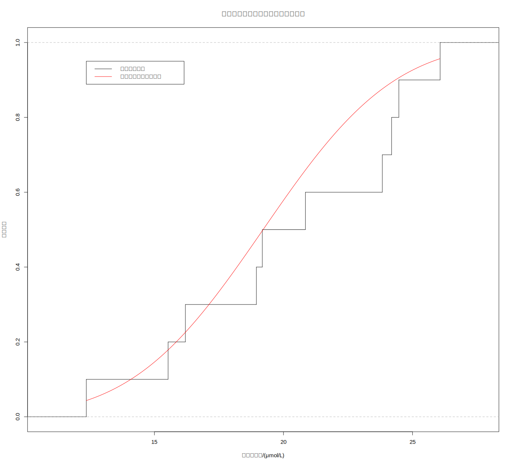
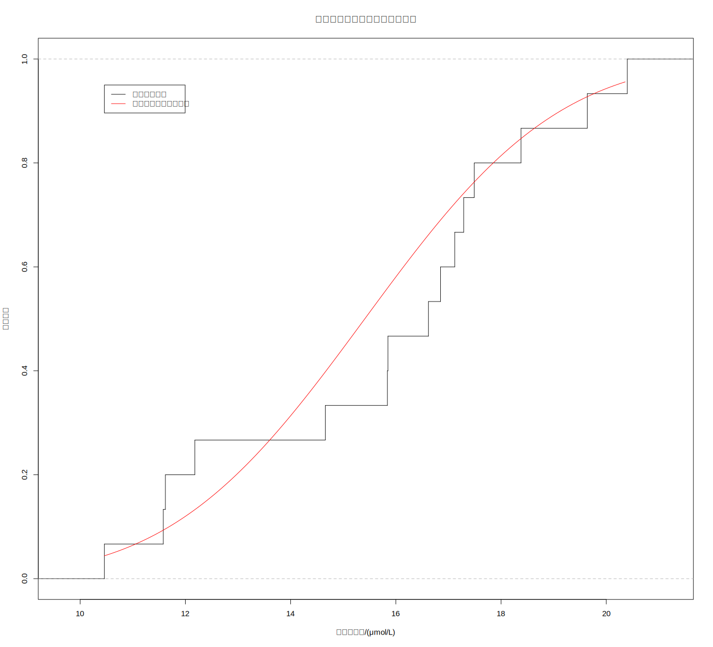

# 第三次作业

## 第一题

> 冠心病患者与健康人血清中的锌含量(μｍol/Ｌ)数据如下
>
> 冠心病患者  18.95  15.53  20.85  24.47  24.19  26.07  12.36  19.18  23.83  16.20
> 健康人 16.85  10.46  17.29  17.49  18.38  20.40  11.62  15.84  17.12  14.66  16.62  12.18  19.64  11.58  15.85
>
> 1) 请绘制两组样本的经验分布图，假设两组样本均来自正态总体，请在图上添加理论分布参考线（交手绘或机打图）。
> 2) 观察图形，判断两组样本是否可能均来自正态总体？是否可能来自同一总体？
> 3) 请分别计算冠心病患者、健康人血清锌含量的95%CI，以及患者和健康人总体均数之差的95%CI。

### 第一问





### 第二问

健康人血清锌含量的经验分布函数更接近正态总体（在均数附近显然经验分布函数变化更快，这说明其数据相对集中于均数附近，类似于正态分布），而冠心病患者血清锌含量经验分布函数偏离较大（看出在中位数右侧变化更快，也即负偏态），故认为健康组样本可能来自正态总体，而患者组反之。进而认为两组样本不可能来自同一总体。

### 第三问

患者组：$16.92783\sim23.39817$
健康组：$14.0491\sim17.4149$
患者和健康人总体均数之差：$1.313737\sim7.548263$


## 第二题

> 请编制R程序，通过模拟抽样方式估算t分布的均数和方差。（写出估算思路和估算结果即可，不必提交程序）

估算思路：从正态总体进行多轮（10000次）抽样，记录每次抽样的均数，最后求出均数和方差，并带入计算公式验证
估算结果：
10000次抽样，记抽样总体为$T$，抽得样本均数记为$\bar{X}$，根据公式：
$$
T \sim N(\mu, \sigma^2) \\
\bar{X} \sim N(\mu, \frac{\sigma^2}{n})
$$
推得理论均数为$0$，理论方差为$0.04$
求得实际均数为$0.001868823$，实际方差为$0.03996815$

```r
result <- c()
for (i in 1:10000) {
    example <- rnorm(100, 0, 2)
    result <- c(result, mean(example))
}
mean(result) # 0.001868823 ≈ 0 = mean(total)
sd(result) # 0.03996815 ≈ 0.04 = 2^2 / 100 = sd(total)^2 / n
```


## 附录

以下为全部作业代码

```r
# Part 1
# 冠心病患者与健康人血清中的锌含量(μｍol/Ｌ)数据如下
# 冠心病患者  18.95  15.53  20.85  24.47  24.19  26.07  12.36  19.18  23.83  16.20
# 健康人 16.85  10.46  17.29  17.49  18.38  20.40  11.62  15.84  17.12  14.66  16.62  12.18  19.64  11.58  15.85 #nolint
#   1) 请绘制两组样本的经验分布图，假设两组样本均来自正态总体，请在图上添加理论分布参考线（交手绘或机打图）。
#   2) 观察图形，判断两组样本是否可能均来自正态总体？是否可能来自同一总体？
#   3) 请分别计算冠心病患者、健康人血清锌含量的95%CI，以及患者和健康人总体均数之差的95%CI。

# 1.1
patient <- c(
    18.95, 15.53, 20.85, 24.47, 24.19,
    26.07, 12.36, 19.18, 23.83, 16.20
)
healthy <- c(
    16.85, 10.46, 17.29, 17.49, 18.38,
    20.40, 11.62, 15.84, 17.12, 14.66,
    16.62, 12.18, 19.64, 11.58, 15.85
)

# Patient
plot(
    ecdf(patient),
    verticals = TRUE, do.points = FALSE, col = "black",
    main = "冠心病患者血清锌含量经验分布函数", xlab = "血清锌含量/(μmol/L)", ylab = "累积概率"
)
x <- seq(min(patient), max(patient), 0.1)
lines(x, pnorm(x, mean(x), sd(x)), col = "red")
legend(
    min(patient), 0.95,
    c("经验分布函数", "标准正态经验分布函数"),
    lty = 1, col = c("black", "red"),
)

# Healthy
plot(ecdf(healthy),
    verticals = TRUE, do.points = FALSE, col = "black",
    main = "健康人血清锌含量经验分布函数", xlab = "血清锌含量/(μmol/L)", ylab = "累积概率"
)
x <- seq(min(healthy), max(healthy), 0.1)
lines(x, pnorm(x, mean(x), sd(x)), col = "red")
legend(
    min(healthy), 0.95,
    c("经验分布函数", "标准正态经验分布函数"),
    lty = 1, col = c("black", "red"),
)

# 1.2
# Conclusion
# 健康人血清锌含量的经验分布函数更接近正态总体，而冠心病患者血清锌含量经验分布函数偏离较大，故认为健康组样本可能来自正态总体，而患者组反之。两组样本不可能来自同一总体。 #nolint

# 1.3
# confidence_interval_95%
ci_patient <- c(
    mean(patient) -
        qt(0.975, length(patient) - 1) * (sd(patient) / sqrt(length(patient))),
    mean(patient) +
        qt(0.975, length(patient) - 1) * (sd(patient) / sqrt(length(patient)))
)
ci_patient # 冠心病患者血清锌含量
t.test(patient) # 16.92783 23.39817

ci_healthy <- c(
    mean(healthy) -
        qt(0.975, length(healthy) - 1) * (sd(healthy) / sqrt(length(healthy))),
    mean(healthy) +
        qt(0.975, length(healthy) - 1) * (sd(healthy) / sqrt(length(healthy)))
)
ci_healthy # 14.0491 17.4149
t.test(healthy) # 14.0491 17.4149

sw <- sqrt(
    (
        (length(patient) - 1) * sd(patient)^2 +
            (length(healthy) - 1) * sd(healthy)^2) /
        (length(patient) + length(healthy) - 2)
)

ci_diff <- c(
    mean(patient) - mean(healthy) -
        qt(0.975, length(patient) + length(healthy) - 2)
        * sw * sqrt(1 / length(patient) + 1 / length(healthy)),
    mean(patient) - mean(healthy) +
        qt(0.975, length(patient) + length(healthy) - 2)
        * sw * sqrt(1 / length(patient) + 1 / length(healthy))
)
ci_diff # 1.313737 7.548263

# Part 2
# 请编制R程序，通过模拟抽样方式估算t分布的均数和方差。（写出估算思路和估算结果即可，不必提交程序）

# example <- rnorm(100, 0, 1) #nolint
# print(t.test(example, mu = 0, alternative = "two.sided")) # nolint

result <- c()
for (i in 1:10000) {
    example <- rnorm(100, 0, 2)
    result <- c(result, mean(example))
}
mean(result) # 0.001868823 ≈ 0 = mean(total)
sd(result)^2 # 0.03996815 ≈ 0.04 = 2^2 / 100 = sd(total)^2 / n

```

