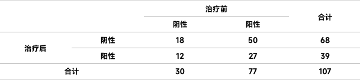

# 第八次作业

## 第一题

> 研究者欲在某大学的本科毕业生人群中开展体育锻炼相关的危险因素调查，其中研究者询问了这些学生在毕业前一年的居住场所，结果见下表：
>
> 请问：不同锻炼水平的毕业生人群的居住场所构成比是否存在差异？

依题意，此为多个独立样本的构成比的比较，共有三个样本。且为双向无序行×列表资料。故采用行×列表资料的$\chi ^2$检验.

建立检验假设，确定检验水准：

$$
H_0:\pi_1=\pi_2=\pi_3\quad 即不同锻炼水平的毕业生人群的居住场所构成比不存在差异\\
H_1:\pi_1,\pi_2,\pi_3不等或不全相等\quad 即不同锻炼水平的毕业生人群的居住场所构成比存在差异\\
\alpha=0.05
$$

```R
# Part 1
data <- read.csv("Homework8/Data1.csv")
data <- matrix(data$cases,
    nrow = 3, byrow = TRUE,
    dimnames = list(
        c("never", "occasionally", "often"),
        c("dorm", "apartment", "off-campus", "home")
    )
)

data
# Chisq test
chisq.test(data)

```

得到 $X-squared = 50.329, df = 6, p-value = 4.038e-09<\alpha=0.05$，从而拒绝$H_0$，接受$H_1$，也即认为不同锻炼水平的毕业生人群的居住场所构成比存在差异。


## 第二题

> 为确定某药物对疾病的治疗效果，研究者记录107名研究对象的治疗前后的疾病诊断结果（阳性或者阴性），其中27名研究对象治疗前和治疗后的诊断结果均为阳性；50名研究对象治疗前的诊断结果为阳性、治疗后的诊断结果为阴性；12名研究对象治疗前的诊断结果为阴性，治疗后的诊断结果为阳性；18名研究对象治疗前和治疗后的诊断结果均为阴性。
>
> 1.请问，这是一种什么类型的研究设计？结局指标是什么类型的变量？
>
> 2.请整理数据，并选择合适的假设检验方法对药物治疗疾病的效果进行评价。

### 第一问

配对设计。结局指标是定性变量中的有序分类变量。


### 第二问



从而建立检验假设和检验水准：
$$
H_0:b=c,即治疗前后疾病诊断结果相同\\
H_1:b\neq c，即治疗前后疾病诊断结果不同\\
\alpha=0.05
$$
根据公式 $\chi^2=\frac{(b-c)^2}{b+c}$，得 $\chi^2=23.29$。

```R
# Part 2
data4 <- matrix(c(18, 50, 12, 27),
    nrow = 2, byrow = TRUE,
    dimnames = list(
        c("after_neg", "after_pos"),
        c("before_neg", "before_pos")
    )
)
data4

mcnemar.test(data4, correct = FALSE)
```

得到 $McNemar's chi-squared = 23.29, df = 1, p-value = 1.393e-06<0.05=\alpha$，从而拒绝$H_0$，接受$H_1$，也即认为治疗前后疾病诊断结果不同。

进一步的，使用二项分布来计算确切概率

建立检验假设和检验水准：
$$
H_0:治疗前后疾病诊断结果相同\\
H_1:治疗后疾病诊断结果优于治疗前\\
\alpha=0.05
$$


```R
binom.test(50, 62, 0.5, alternative = "greater")
```

得到 $p-value = 6.072e-07<\alpha=0.05$，从而拒绝$H_0$，接受$H_1$，也即认为药物治疗有效。
